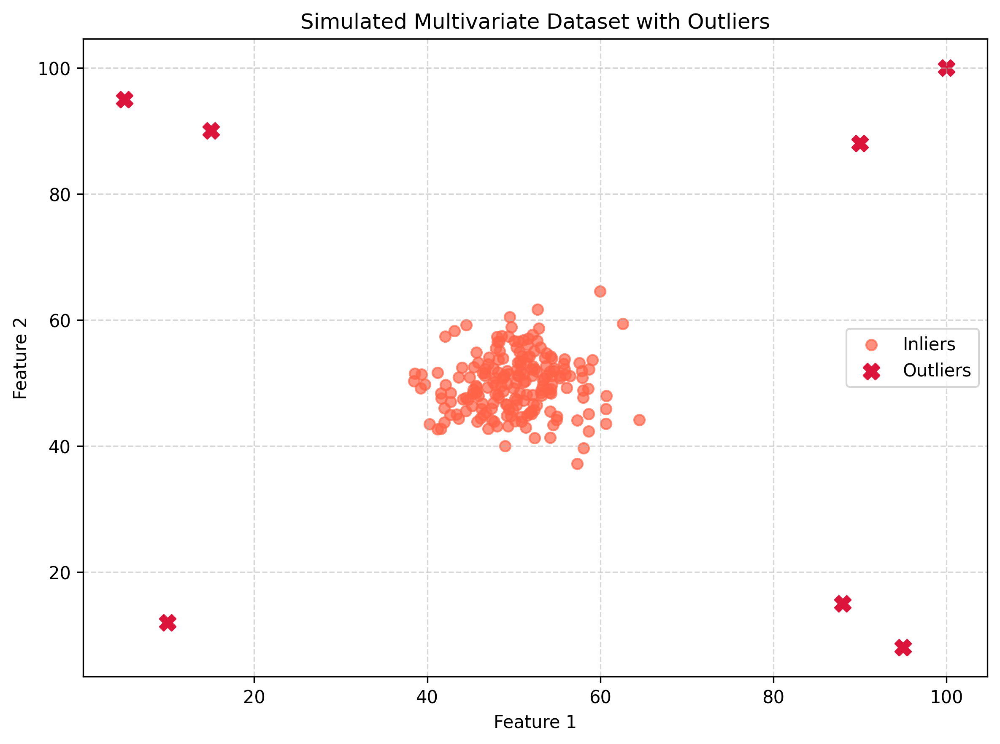
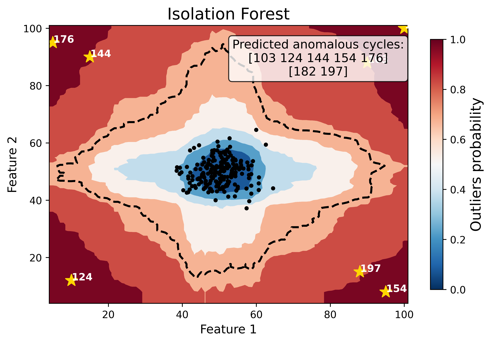

Synthetic Multivariate Dataset
################################

Beyond the Severson and Tohoku battery datasets, OSBAD is also benchmarked on a
**synthetic multivariate dataset** that is deliberately decoupled from any
specific battery chemistry or application. The purpose of this dataset is to
demonstrate that OSBAD **generalizes beyond battery applications**. Because the
framework operates on generic feature vectors rather than domain-specific
battery signals (such as ``voltage`` or ``discharge_capacity``), the same
detection and evaluation workflow can be applied to entirely new chemistries,
materials, and applications without modification.

Unlike the battery datasets, whose primary anomaly signal is univariate
(e.g. capacity fade against cycle index), this dataset is **multivariate**:
each sample is described by two independent features (``feature_1`` and
``feature_2``). The outliers are injected as extreme two-dimensional points
that sit far from the compact inlier cluster, covering the corners of the
feature space. This provides a controlled setting with a **known ground truth**
for benchmarking anomaly detection methods.

Purpose of the Synthetic Multivariate Outliers
================================================

- **Generalization beyond batteries**: Show that OSBAD is not restricted to
  battery cycling data and can detect anomalies in any tabular, multivariate
  feature space.
- **Domain-agnostic benchmarking**: Provide a dataset that is independent of
  battery chemistry, so the workflow can transfer to new chemistries,
  materials, catalysis, or other scientific domains.
- **Controlled ground truth**: Because the outliers are injected manually, their
  positions and labels are known exactly, enabling unambiguous evaluation with a
  confusion matrix and standard metrics.
- **Multivariate detection**: Extend the benchmark from a single feature to a
  two-dimensional feature space, testing the ability of models such as the
  Isolation Forest to isolate anomalies across multiple dimensions.

Dataset Generation
====================

A synthetic two-dimensional dataset is generated with a fixed random seed
(``seed=42``) to ensure reproducibility across runs:

- **Inliers**: 200 samples drawn from a 2D normal distribution centred at
  :math:`\mu = 50` with standard deviation :math:`\sigma = 5` in each dimension,
  forming a compact circular cluster.
- **Outliers**: 7 extreme two-dimensional points manually injected far from the
  inlier cluster (``[10, 12]``, ``[90, 88]``, ``[5, 95]``, ``[95, 8]``,
  ``[15, 90]``, ``[88, 15]``, ``[100, 100]``), covering the corners of the
  feature space.
- **Combined dataset**: The inliers and outliers are stacked into 207 samples
  and shuffled together with their labels, then stored with an ``index``,
  ``feature_1``, and ``feature_2`` column.

Since the injected outliers are known in advance, their ``index`` values serve
as the ground-truth labels for evaluating anomaly detection methods.

Dataset Information
====================

* **Total number of samples**: 207
* **Number of inliers**: 200 (2D Gaussian blob, :math:`\mu = 50`, :math:`\sigma = 5`)
* **Number of injected outliers**: 7
* **Number of features**: 2 (``feature_1``, ``feature_2``)
* **File format**: CSV file (``multivariate_dataset.csv``)
* **Random seed**: 42 (reproducible)
* **Missing values**: None (100% complete dataset)
* **Target variable**: injected outlier ``index`` (ground truth)

Feature Description
====================

.. list-table::
   :header-rows: 1
   :widths: 15 10 40 20 15

   * - Feature
     - Type
     - Description
     - Range/Values
     - Anomaly Relevance
   * - ``index``
     - Integer
     - Sequential sample identifier used to align predictions with ground truth
     - 0 - 206
     - Reference - Used to match predicted and true outliers
   * - ``feature_1``
     - Float
     - First synthetic dimension of the feature vector
     - ~5 - 100
     - High - Primary input dimension for detection
   * - ``feature_2``
     - Float
     - Second synthetic dimension of the feature vector
     - ~8 - 100
     - High - Primary input dimension for detection

.. important::

   Both ``feature_1`` and ``feature_2`` are used directly as model inputs.
   The injected outliers are separated from the inlier cluster in **both**
   dimensions simultaneously, which makes this a genuinely multivariate anomaly
   detection problem rather than a per-feature thresholding task.

Multivariate Outlier Detection Example
=======================================

To illustrate the benchmark, an Isolation Forest baseline (without
hyperparameter tuning) is applied to the two synthetic features through the
OSBAD ``ModelRunner``. The anomaly score map below shows the probabilistic
outlier score across the feature space: the inlier cluster (blue, low score) is
clearly separated from the injected outliers (yellow stars) that fall in the
high-score (red) regions beyond the decision boundary.

The predicted outliers are then compared against the known injected outliers
using the same evaluation protocol (confusion matrix and metrics such as
accuracy, precision, recall, F1-score, and MCC) applied to the battery
datasets. This confirms that OSBAD's detection and evaluation pipeline
transfers unchanged from battery data to a domain-agnostic multivariate
setting.

