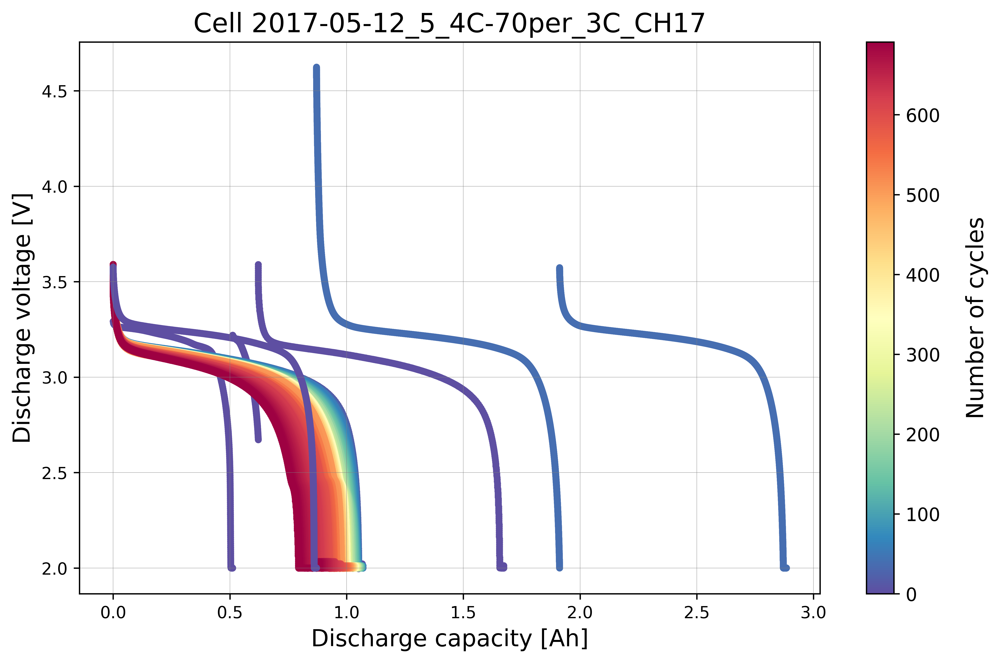
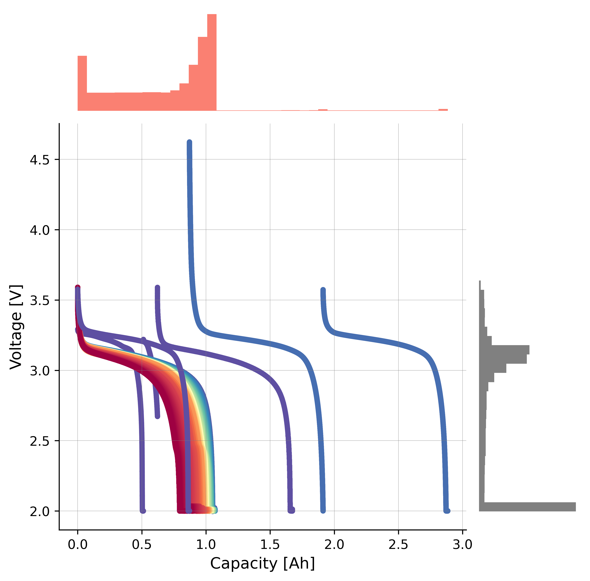
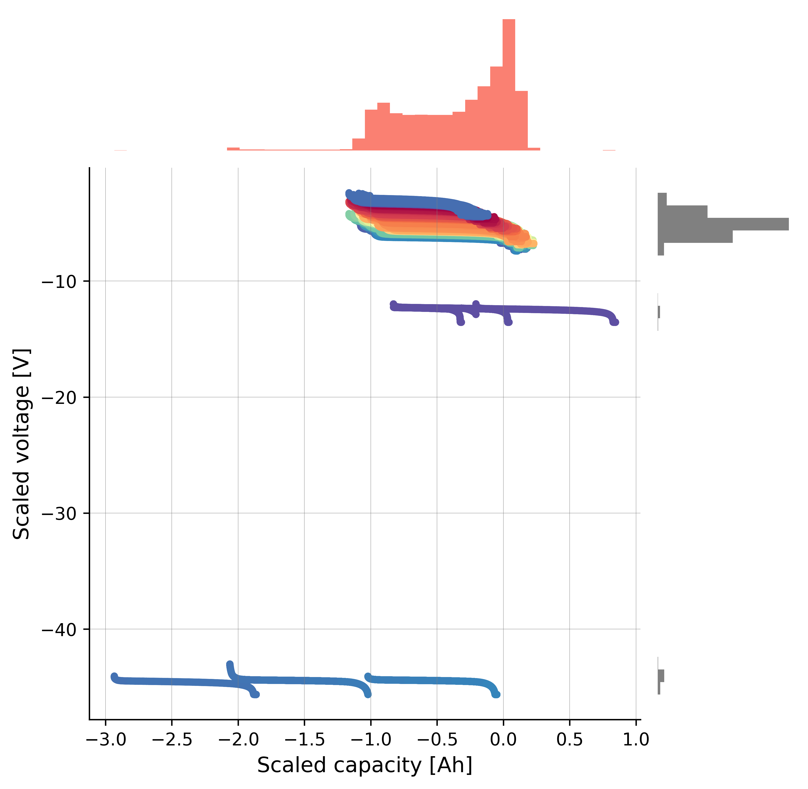
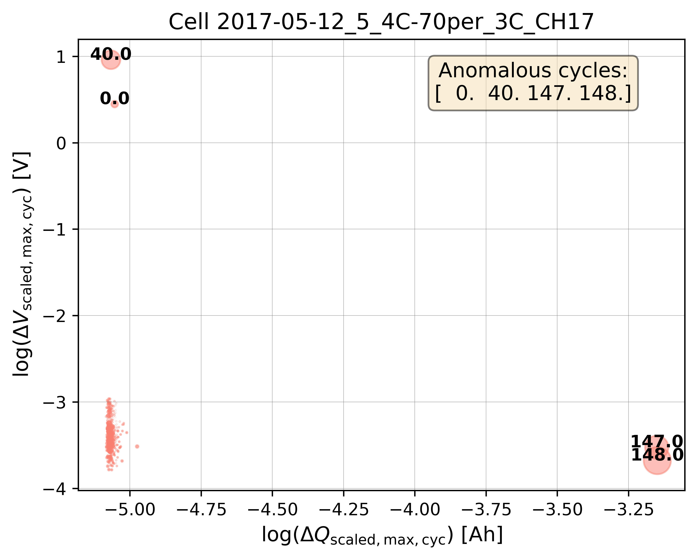
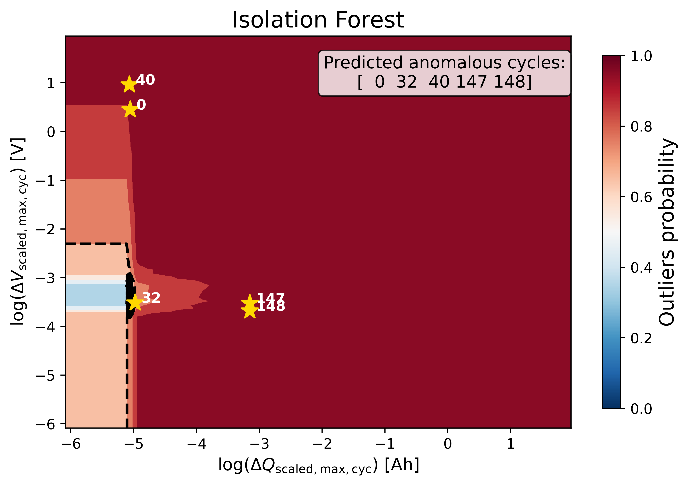
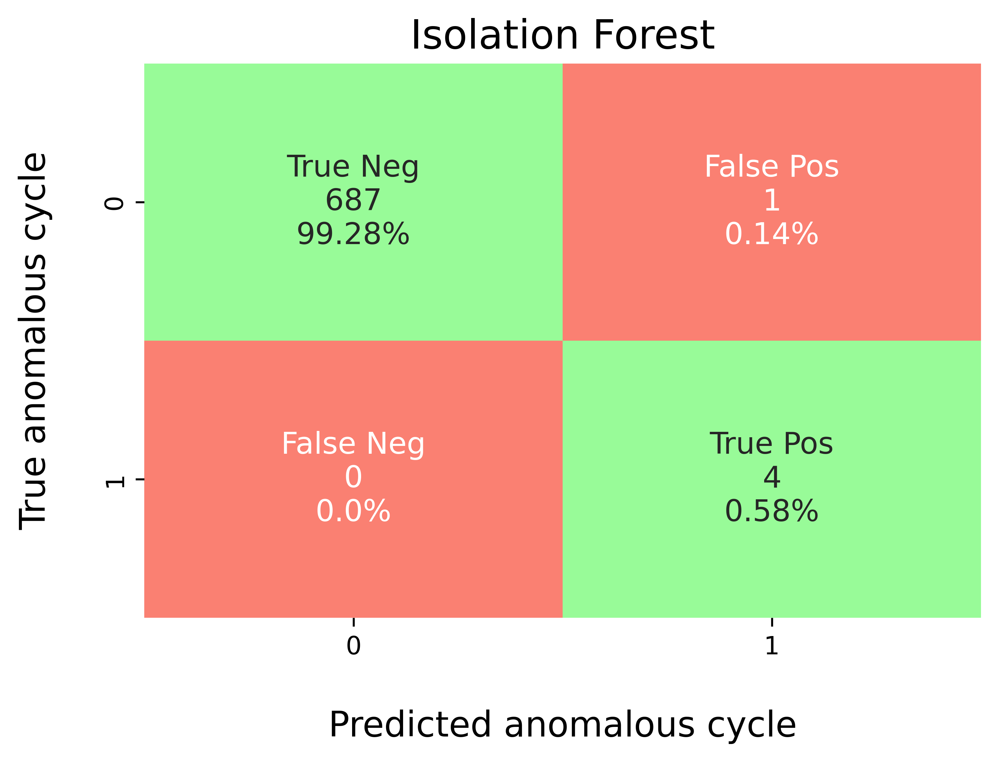

Example (1): Baseline Isolation Forest without Hyperparameter Tuning
======================================================================

Prerequisites
---------------

* Python 3.12 (recommended)
* Files on disk:

  * ``database/train_dataset_severson.db`` (benchmark labels per cycle)

* (Optional) LaTeX installation if you want Matplotlib to render text with
  LaTeX:

  * A TeX distribution (e.g., TeX Live/MacTeX/MiKTeX), dvipng, and fonts
    like cm-super.
  * Don't have LaTeX installed? Either install it, or set
    ``rcParams["text.usetex"] = False``.

Before running the example in the ``machine_learning/baseline_models``
section, please evaluate whether the global directory path specified in
``src/osbad/config.py`` needs to be updated:

.. code-block:: python

    # Modify this global directory path if needed
    PIPELINE_OUTPUT_DIR = Path.cwd().joinpath("artifacts_output_dir")

The following example of running a baseline Isolation Forest model (without
hyperparameter tuning) is also provided as a notebook in
``machine_learning/baseline_models/severson_data_source/ml_01_iforest_baseline_severson.ipynb``.

Step-1: Load libraries
---------------------------

Import the libraries into your local development environment, including the
``osbad`` library for benchmarking anomaly detection.

* ``Path`` is used for robust, cross-platform file paths.
* ``pprint`` pretty-prints data structures for readable diagnostics.
* ``duckdb`` is the embedded analytical database engine storing the dataset.
* ``optuna`` is a hyperparameter optimization framework (available for
  later tuning workflows).
* ``bconf``: project config utilities (e.g., where to write artifacts).
* ``BenchDB``: a thin layer around DuckDB that provides convenience loaders.
* ``CycleScaling``: implements the statistical feature transformation
  methods for scaling cycle data.
* ``ModelRunner``, ``hp``, ``modval``, ``bviz``: modeling,
  hyperparameters, model validation, and visualization helpers for the
  benchmarking study.

.. code-block:: python

    # Standard library
    from pathlib import Path
    import pprint

    # Third-party libraries
    import duckdb
    import pandas as pd
    import matplotlib as mpl
    import matplotlib.pyplot as plt
    import numpy as np
    import optuna

    # Custom osbad library for anomaly detection
    import osbad.config as bconf
    import osbad.hyperparam as hp
    import osbad.modval as modval
    import osbad.viz as bviz
    from osbad.database import BenchDB
    from osbad.scaler import CycleScaling
    from osbad.model import ModelRunner

Step-2: Load Benchmarking Dataset
------------------------------------

* Define the path to the DuckDB database file using the ``DB_DIR`` from
  ``bconf``.
* Create a DuckDB connection (read-only) and load the full training dataset
  from the ``df_train_dataset_sv`` table.
* Retrieve the unique cell indices available in the training dataset.

.. code-block:: python

    # Path to database directory
    DB_DIR = bconf.DB_DIR

    db_filepath = DB_DIR.joinpath("train_dataset_severson.db")

    # Create a DuckDB connection
    con = duckdb.connect(
        db_filepath,
        read_only=True)

    # Load all training dataset from duckdb
    df_duckdb = con.execute(
        "SELECT * FROM df_train_dataset_sv").fetchdf()

    # Get the cell index of training dataset
    unique_cell_index_train = df_duckdb["cell_index"].unique()
    print(f"Unique cell index: {unique_cell_index_train}")

Step-3: Filter Dataset for a Selected Cell
---------------------------------------------

* Pick a specific cell based on ``selected_cell_label``, which identifies
  the experimental data corresponding to one unique cell.
* Create an artifacts folder for that cell, where you can save figures,
  tables, or model outputs related to this cell.
* Filter the loaded dataset for the selected cell only and extract the
  ground-truth outlier cycle indices.

.. code-block:: python

    # Get the cell-ID from cell_inventory
    selected_cell_label = "2017-05-12_5_4C-70per_3C_CH17"

    # Create a subfolder to store fig output
    # corresponding to each cell-index
    selected_cell_artifacts_dir = bconf.artifacts_output_dir(
        selected_cell_label)

    # Filter dataset for specific selected cell only
    df_selected_cell = df_duckdb[
        df_duckdb["cell_index"] == selected_cell_label]

    # Anomalous cycle has label = 1
    # Normal cycle has label = 0
    # true outliers from benchmarking dataset
    df_true_outlier = df_selected_cell[
        df_selected_cell["outlier"] == 1]

    # Get the cycle index of anomalous cycle
    true_outlier_cycle_index = (
        df_true_outlier["cycle_index"].unique())

Step-4: Drop True Labels
-----------------------------

* Drop the true outlier labels (denoted as ``outlier``) from the dataframe
  and select only the relevant features for machine learning:

  * ``cell_index``: The cell-ID for data and model versioning purposes.
  * ``cycle_index``: The cycle number of each cell.
  * ``discharge_capacity``: Discharge capacity of the cell.
  * ``voltage``: Discharge voltage of the cell.

* Initialize ``BenchDB`` for the selected cell and load the benchmarking
  dataset from the training partition.
* Extract the true outlier cycle indices for later evaluation.

.. code-block:: python

    # Import the BenchDB class
    # Load only the dataset based on the selected cell
    benchdb = BenchDB(
        db_filepath,
        selected_cell_label)

    # load the benchmarking dataset
    df_selected_cell = benchdb.load_benchmark_dataset(
        dataset_type="train")

    if df_selected_cell is not None:

        filter_col = [
            "cell_index",
            "cycle_index",
            "discharge_capacity",
            "voltage"]

        # Drop true labels from the benchmarking dataset
        # and filter for selected columns only
        df_selected_cell_without_labels = benchdb.drop_labels(
            df_selected_cell,
            filter_col)

        # Extract true outliers cycle index from benchmarking dataset
        true_outlier_cycle_index = benchdb.get_true_outlier_cycle_index(
            df_selected_cell)

Step-5: Plot Cycle Data without Labels
-----------------------------------------

* Visualize the cycling data for the selected cell without displaying the
  true outlier labels. This represents what the model sees before training.

.. code-block:: python

    # Plot cell data with true anomalies
    # If the true outlier cycle index is not known,
    # cycling data will be plotted without labels
    benchdb.plot_cycle_data(
        df_selected_cell_without_labels)

    output_fig_filename = (
        "cycle_data_nolabel_"
        + selected_cell_label
        + ".png")

    fig_output_path = (
        selected_cell_artifacts_dir
        .joinpath(output_fig_filename))

    plt.savefig(
        fig_output_path,
        dpi=600,
        bbox_inches="tight")

    plt.show()

Step-6: Statistical Feature Transformation
---------------------------------------------

To help separate abnormal cycles from normal cycles, a statistical feature
transformation method is applied using the median and IQR of the input
features:

.. math::

    x_\textrm{scaled} = x_i - \left[\frac{\textrm{median}(X)^{2}}
    {\textrm{IQR}(X)}\right],

where the IQR can be calculated from the third (75th percentile) and first
quartile (25th percentile) of the input vector
(:math:`\textrm{IQR}(X) = Q_3(X) - Q_1(X)`).
Here, :math:`\textrm{median}(X)^2` preserves the physical unit of the
original feature after transformation. Feature scaling is implemented on
both the capacity and voltage data.

Capacity scaling
^^^^^^^^^^^^^^^^^

.. code-block:: python

    # Instantiate the CycleScaling class
    scaler = CycleScaling(
        df_selected_cell=df_selected_cell_without_labels)

    # Implement median IQR scaling on the discharge capacity data
    df_capacity_med_scaled = scaler.median_IQR_scaling(
        variable="discharge_capacity",
        validate=True)

    # Plot the histogram and boxplot of the scaled data
    ax_hist = bviz.hist_boxplot(
        df_variable=df_capacity_med_scaled["scaled_discharge_capacity"])

    ax_hist.set_xlabel(
        r"Discharge capacity [Ah]",
        fontsize=12)
    ax_hist.set_ylabel(
        r"Count",
        fontsize=12)

    output_fig_filename = (
        "cap_scaling_"
        + selected_cell_label
        + ".png")

    fig_output_path = (
        selected_cell_artifacts_dir
        .joinpath(output_fig_filename))

    plt.savefig(
        fig_output_path,
        dpi=600,
        bbox_inches="tight")

    plt.show()

Voltage scaling
^^^^^^^^^^^^^^^^^

.. code-block:: python

    # Implement median IQR scaling on the discharge voltage data
    df_voltage_med_scaled = scaler.median_IQR_scaling(
        variable="voltage",
        validate=True)

    # Plot the histogram and boxplot of the scaled data
    ax_hist = bviz.hist_boxplot(
        df_variable=df_voltage_med_scaled["scaled_voltage"])

    ax_hist.set_xlabel(
        r"Scaled voltage [V]",
        fontsize=12)
    ax_hist.set_ylabel(
        r"Count",
        fontsize=12)

    output_fig_filename = (
        "voltage_scaling_"
        + selected_cell_label
        + ".png")

    fig_output_path = (
        selected_cell_artifacts_dir
        .joinpath(output_fig_filename))

    plt.savefig(
        fig_output_path,
        dpi=600,
        bbox_inches="tight")

    plt.show()

Scatter histogram
^^^^^^^^^^^^^^^^^^

* Create a scatterplot with histograms to display the distribution for the
  x-axis and y-axis:

  * The salmon color corresponds to the x-axis (``discharge_capacity``).
  * The grey color corresponds to the y-axis (``voltage``).

.. code-block:: python

    axplot = bviz.scatterhist(
        xseries=df_selected_cell_without_labels["discharge_capacity"],
        yseries=df_selected_cell_without_labels["voltage"],
        cycle_index_series=df_selected_cell_without_labels["cycle_index"])

    axplot.set_xlabel(
        r"Capacity [Ah]",
        fontsize=12)
    axplot.set_ylabel(
        r"Voltage [V]",
        fontsize=12)

    plt.show()

Before applying the scaling transformation, the scatterplot with histograms
shows that the anomalous cycles are closely clustered with the normal
cycles, making it difficult for the model to learn a clear decision boundary.
After applying the scaling transformation, the anomalous cycles are more
separated from the normal cycles, which can help the model to better identify
the anomalies.

After applying the scaling transformation:

.. code-block:: python

    axplot = bviz.scatterhist(
        xseries=df_capacity_med_scaled["scaled_discharge_capacity"],
        yseries=df_voltage_med_scaled["scaled_voltage"],
        cycle_index_series=df_selected_cell_without_labels["cycle_index"])

    axplot.set_xlabel(
        r"Scaled capacity [Ah]",
        fontsize=12)
    axplot.set_ylabel(
        r"Scaled voltage [V]",
        fontsize=12)

    plt.show()

Step-7: Physics-informed Feature Extraction
---------------------------------------------

As the anomalies in this dataset are collective due to a continuous series
of abnormal voltage and current measurements, the collective anomalies of a
given cycle can be transformed into cycle-wise point anomalies.

.. math::

    \Delta Q_\textrm{scaled,max,cyc} = \underset{\textrm{cyc}}{\max}
    (Q_{\textrm{scaled},{k+1}} - Q_{\textrm{scaled},{k}}),

.. math::

    \Delta V_\textrm{scaled,max,cyc} = \underset{\textrm{cyc}}{\max}
    (V_{\textrm{scaled},{k+1}} - V_{\textrm{scaled},{k}}),

where :math:`\Delta V_\textrm{scaled,max,cyc}` is the maximum scaled
voltage difference per cycle, :math:`\Delta Q_\textrm{scaled,max,cyc}` is
the maximum scaled capacity difference per cycle, and :math:`k` denotes the
index of each recorded data point.

Feature max dQ
^^^^^^^^^^^^^^^

.. code-block:: python

    # maximum scaled capacity difference per cycle
    df_max_dQ = scaler.calculate_max_diff_per_cycle(
        df_scaled=df_capacity_med_scaled,
        variable_name="scaled_discharge_capacity")

    # Update the column name to include dQ into the name
    df_max_dQ.columns = [
        "max_diff_dQ",
        "log_max_diff_dQ",
        "cycle_index"]

Feature max dV
^^^^^^^^^^^^^^^

.. code-block:: python

    # maximum scaled voltage difference per cycle
    df_max_dV = scaler.calculate_max_diff_per_cycle(
        df_scaled=df_voltage_med_scaled,
        variable_name="scaled_voltage")

    # Update the column name to include dV into the name
    df_max_dV.columns = [
        "max_diff_dV",
        "log_max_diff_dV",
        "cycle_index"]

Merge features
^^^^^^^^^^^^^^^

* Merge the ``df_max_dV`` and ``df_max_dQ`` dataframes into a single
  feature dataframe, removing duplicated ``cycle_index`` columns.

.. code-block:: python

    # Merge both df_max_dV, df_max_dQ into a df
    # Remove the duplicated cycle_index column
    df_merge = pd.concat([df_max_dV, df_max_dQ], axis=1)
    df_merge_features = df_merge.loc[
        :, ~df_merge.columns.duplicated()].copy()

Step-8: Bubble Plot Visualization
------------------------------------

* Calculate the bubble size ratios from the feature distributions for
  plotting.
* Plot bubble charts both with and without log transformation to
  visualize the separation of anomalous cycles.

Bubble plot without log transformation
^^^^^^^^^^^^^^^^^^^^^^^^^^^^^^^^^^^^^^^^

.. code-block:: python

    # Calculate the bubble size ratio for plotting
    df_bubble_size_dQ = bviz.calculate_bubble_size_ratio(
        df_variable=df_max_dQ["max_diff_dQ"])

    df_bubble_size_dV = bviz.calculate_bubble_size_ratio(
        df_variable=df_max_dV["max_diff_dV"])

    # Get the cycle count to label the bubbles
    unique_cycle_count = (
        df_selected_cell_without_labels["cycle_index"]
        .unique())

    # bubble size for multivariate anomalies
    bubble_size = (
        np.abs(df_bubble_size_dV)
        * np.abs(df_bubble_size_dQ))

    # Plot the bubble chart and label the outliers
    axplot = bviz.plot_bubble_chart(
        xseries=df_merge_features["max_diff_dQ"],
        yseries=df_merge_features["max_diff_dV"],
        bubble_size=bubble_size,
        unique_cycle_count=unique_cycle_count,
        cycle_outlier_idx_label=true_outlier_cycle_index)

    axplot.set_xlabel(
         r"$\Delta Q_{\mathrm{scaled,max,cyc}}$ [Ah]",
         fontsize=12)
    axplot.set_ylabel(
         r"$\Delta V_{\mathrm{scaled,max,cyc}}$ [V]",
         fontsize=12)

    plt.show()

Bubble plot with log transformation
^^^^^^^^^^^^^^^^^^^^^^^^^^^^^^^^^^^^^

Log transformation helps to improve the visualization of closely clustered
data points and to better separate the anomalous cycles from the normal
cycles, especially when the feature values span several orders of magnitude.

.. code-block:: python

    # Plot the bubble chart and label the outliers
    axplot = bviz.plot_bubble_chart(
        xseries=df_merge_features["log_max_diff_dQ"],
        yseries=df_merge_features["log_max_diff_dV"],
        bubble_size=bubble_size,
        unique_cycle_count=unique_cycle_count,
        cycle_outlier_idx_label=true_outlier_cycle_index)

    axplot.set_title(
        f"Cell {selected_cell_label}", fontsize=13)

    axplot.set_xlabel(
         r"$\log(\Delta Q_{\mathrm{scaled,max,cyc}})$ [Ah]",
         fontsize=12)
    axplot.set_ylabel(
         r"$\log(\Delta V_{\mathrm{scaled,max,cyc}})$ [V]",
         fontsize=12)

    output_fig_filename = (
        "multivariate_bubble_plot_"
        + selected_cell_label
        + ".png")

    fig_output_path = (
        selected_cell_artifacts_dir
        .joinpath(output_fig_filename))

    plt.savefig(
        fig_output_path,
        dpi=600,
        bbox_inches="tight")

    plt.show()

Step-9: Baseline Isolation Forest (without hyperparameter tuning)
-------------------------------------------------------------------

* Create a ``ModelRunner`` instance with the selected features
  (``log_max_diff_dQ``, ``log_max_diff_dV``) and the cell label.
* Build the training input matrix ``Xdata``
  (shape: n_cycles × n_features).
* Instantiate the baseline Isolation Forest model using
  ``cfg.baseline_model_param()`` (default hyperparameters, no tuning).
* Fit the model, compute probabilistic outlier scores, and extract the
  predicted outlier cycle indices using a threshold of ``0.7``.

.. code-block:: python

    selected_feature_cols = (
        "log_max_diff_dQ",
        "log_max_diff_dV")

    # Instantiate ModelRunner with selected features and cell_label
    runner = ModelRunner(
        cell_label=selected_cell_label,
        df_input_features=df_merge_features,
        selected_feature_cols=selected_feature_cols
    )

    # create Xdata array
    Xdata = runner.create_model_x_input()

    # Extract the model configuration for Isolation Forest
    cfg = hp.MODEL_CONFIG["iforest"]

    # create model instance without hyperparameter tuning
    model = cfg.baseline_model_param()
    model.fit(Xdata)

    # Predict probabilistic outlier score
    proba = model.predict_proba(Xdata)

    # Get predicted outlier cycle and score from
    # the probabilistic outlier score
    (pred_outlier_indices,
     pred_outlier_score) = runner.pred_outlier_indices_from_proba(
        proba=proba,
        threshold=0.7,
        outlier_col=cfg.proba_col
    )

    print("Predicted anomalous cycles:")
    print(pred_outlier_indices)
    print("-"*70)
    print("Predicted corresponding outlier score:")
    print(pred_outlier_score)

To inspect the default hyperparameters of the baseline model:

.. code-block:: python

    # Access the default hyperparameters without tuning
    baseline_model_param = model.get_params()
    pprint.pp(baseline_model_param)

Step-10: Predict Probabilistic Anomaly Score Map
---------------------------------------------------

* ``pred_outlier_indices`` is a list of cycle indices predicted as
  anomalous by the baseline Isolation Forest model. Using ``.isin()``,
  the dataframe is filtered to keep only cycles identified as anomalies.
* A new column, ``outlier_prob``, is added to store the outlier probability
  computed by the model, making it easy to track how confidently the
  algorithm flags each cycle.
* ``runner.predict_anomaly_score_map`` generates a 2D contour map of
  anomaly scores (outlier probability).

.. code-block:: python

    # Filter the selected features based on predicted outlier indices
    df_outliers_pred = df_merge_features[
        df_merge_features["cycle_index"]
        .isin(pred_outlier_indices)].copy()

    df_outliers_pred["outlier_prob"] = pred_outlier_score

    # Plot the anomaly score map
    axplot = runner.predict_anomaly_score_map(
        selected_model=model,
        model_name="Isolation Forest",
        xoutliers=df_outliers_pred["log_max_diff_dQ"],
        youtliers=df_outliers_pred["log_max_diff_dV"],
        pred_outliers_index=pred_outlier_indices,
        threshold=0.7)

    axplot.set_xlabel(
         r"$\log(\Delta Q_{\mathrm{scaled,max,cyc}})$ [Ah]",
         fontsize=12)
    axplot.set_ylabel(
         r"$\log(\Delta V_{\mathrm{scaled,max,cyc}})$ [V]",
         fontsize=12)

    output_fig_filename = (
        "isolation_forest_"
        + selected_cell_label
        + ".png")

    fig_output_path = (
        selected_cell_artifacts_dir
        .joinpath(output_fig_filename))

    plt.savefig(
        fig_output_path,
        dpi=600,
        bbox_inches="tight")

    plt.show()

The figure shows the anomaly score map produced by the baseline Isolation
Forest model:

* **Background Heatmap**:

  * Red regions: high anomaly probability (more likely to contain outliers).
  * Blue/white regions: low anomaly probability (normal cycles).

* **Dashed Black Contour**:

  * Represents the decision boundary defined by the Isolation Forest
    threshold. Points outside are considered anomalies.

* **Black Dots**:

  * Represent the majority of normal cycles (inlier data).

* **Yellow Stars with Labels**:

  * Mark the detected anomalous cycles. Their positions in the 2D feature
    space highlight where they deviate from typical battery behavior.

* **Colorbar (right)**:

  * Quantifies anomaly probability (0 = normal, 1 = highly anomalous).

Histogram of the anomaly score
^^^^^^^^^^^^^^^^^^^^^^^^^^^^^^^^

.. code-block:: python

    outlier_score = model.decision_function(Xdata)

    fig, ax = plt.subplots(figsize=(10, 6))

    ax.hist(
        outlier_score,
        color="skyblue",
        edgecolor="black",
        bins=25)

    ax.set_xlabel(
        "Predicted anomaly score",
        fontsize=12)

    ax.grid(
        color="grey",
        linestyle="-",
        linewidth=0.25,
        alpha=0.7)

    plt.show()

Step-11: Model Performance Evaluation
-----------------------------------------

* Map predicted outlier indices to the benchmark dataset:

  * ``df_selected_cell`` holds cycle-level records and the ground-truth
    label (e.g., ``outlier`` = 1 for anomalous cycles, else 0).
  * ``pred_outlier_indices`` is the list of cycle indices flagged by the
    model.

* ``modval.evaluate_pred_outliers(...)`` returns a tidy DataFrame with:

  * ``cycle_index``: Cell discharge cycle index.
  * ``true_outlier``: ground truth (0/1).
  * ``pred_outlier``: model prediction (0/1) for the same cycles.

* ``modval.generate_confusion_matrix(...)`` aggregates counts of:

  * ``True Negative (TN)``: predicted 0, truth 0.
  * ``False Positive (FP)``: predicted 1, truth 0.
  * ``False Negative (FN)``: predicted 0, truth 1.
  * ``True Positive (TP)``: predicted 1, truth 1.

.. code-block:: python

    # Compare predicted probabilistic outliers against true outliers
    # from the benchmarking dataset
    df_eval_outlier = modval.evaluate_pred_outliers(
        df_benchmark=df_selected_cell,
        outlier_cycle_index=pred_outlier_indices)

Confusion matrix
^^^^^^^^^^^^^^^^^^

.. code-block:: python

    axplot = modval.generate_confusion_matrix(
        y_true=df_eval_outlier["true_outlier"],
        y_pred=df_eval_outlier["pred_outlier"])

    axplot.set_title(
        "Isolation Forest",
        fontsize=16)

    output_fig_filename = (
        "conf_matrix_iforest_"
        + selected_cell_label
        + ".png")

    fig_output_path = (
        selected_cell_artifacts_dir
        .joinpath(output_fig_filename))

    plt.savefig(
        fig_output_path,
        dpi=600,
        bbox_inches="tight")

    plt.show()

Evaluation metrics
^^^^^^^^^^^^^^^^^^^^

In this study, five different metrics are used to evaluate model performance:

* **Accuracy**: :math:`\frac{\textrm{TP} + \textrm{TN}}{\textrm{Total prediction}}`
* **Precision**: :math:`\frac{\textrm{TP}}{\textrm{TP + FP}}`
* **Recall**: :math:`\frac{\textrm{TP}}{\textrm{TP + FN}}`
* **F1-score**: :math:`\frac{2(\textrm{Precision}\times \textrm{Recall})}{\textrm{Precision} + \textrm{Recall}}`
* **MCC**: :math:`\frac{TP \times TN - FP \times FN}{\sqrt{(TP + FP)(TP + FN)(TN + FP)(TN+FN)}}`

.. code-block:: python

    df_current_eval_metrics = modval.eval_model_performance(
        model_name="iforest",
        selected_cell_label=selected_cell_label,
        df_eval_outliers=df_eval_outlier)

Step-12: Export Evaluation Metrics
-------------------------------------

* Export the evaluation metrics to a CSV file for record-keeping and
  comparison across models.

.. code-block:: python

    # Export current metrics to CSV
    metrics_eval_filepath = Path.cwd().joinpath(
        "eval_metrics_no_hp_severson.csv")

    hp.export_current_model_metrics(
        model_name="iforest",
        selected_cell_label=selected_cell_label,
        df_current_eval_metrics=df_current_eval_metrics,
        export_csv_filepath=metrics_eval_filepath,
        if_exists="replace")
