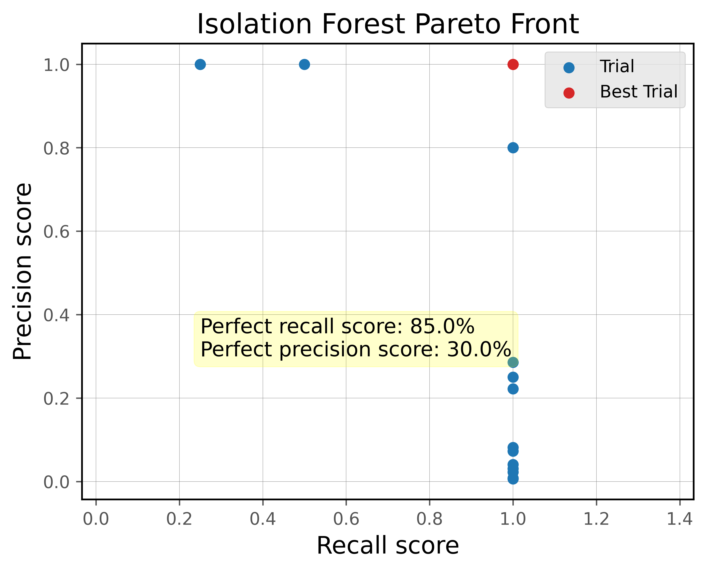
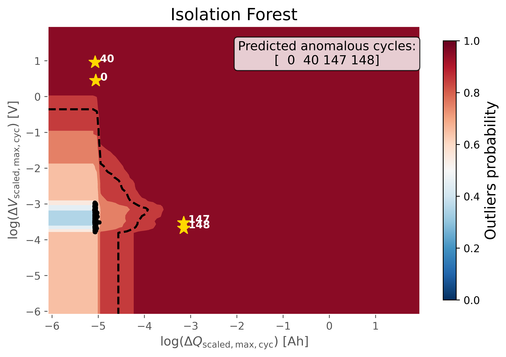
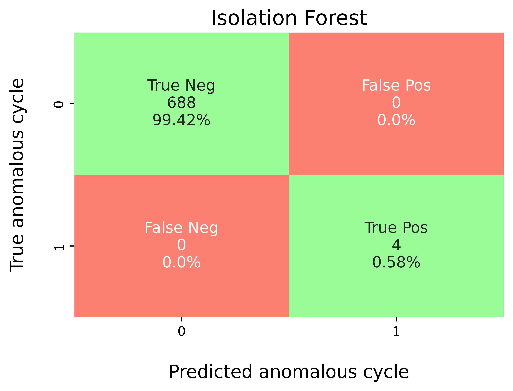
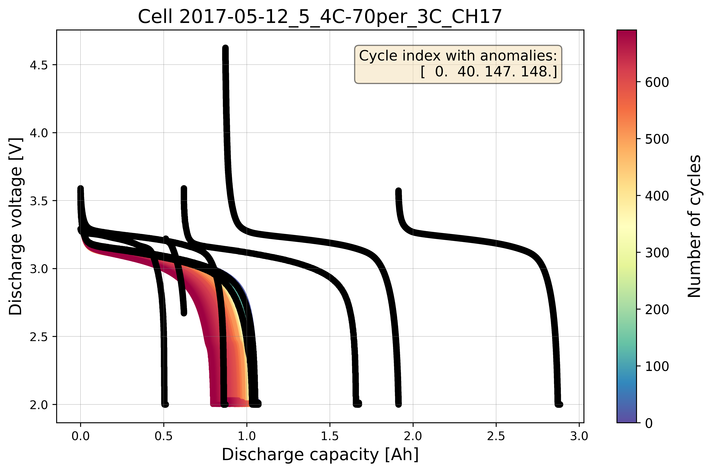
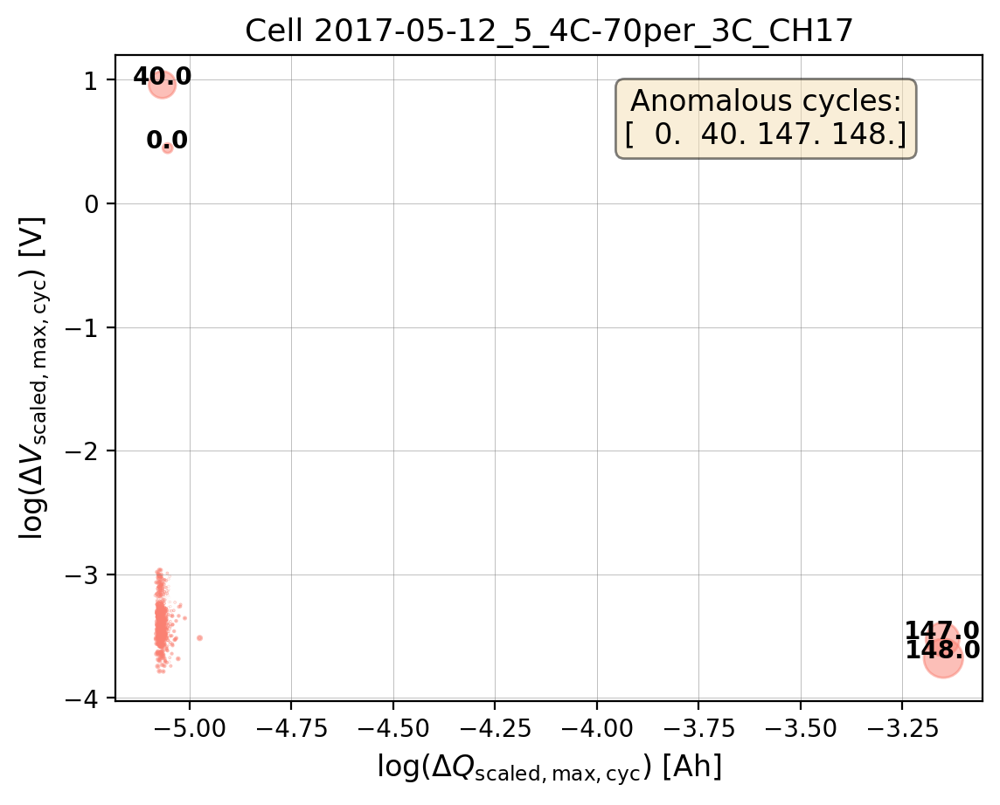

Example (2): Isolation Forest with Hyperparameter Tuning
===========================================================

Prerequisites
---------------

* Python 3.12 (recommended)
* Files on disk:

  * ``database/train_dataset_severson.db`` (benchmark labels per cycle)
  * ``database/train_features_severson.db`` (precomputed features per cycle)

* (Optional) LaTeX installation if you want Matplotlib to render text with
  LaTeX:

  * A TeX distribution (e.g., TeX Live/MacTeX/MiKTeX), dvipng, and fonts
    like cm-super.
  * Don't have LaTeX installed? Either install it, or set
    ``rcParams["text.usetex"] = False``.

Before running the example in the
``machine_learning/hp_tuning_with_transfer_learning`` section, please
evaluate whether the global directory path specified in
``src/osbad/config.py`` needs to be updated:

.. code-block:: python

    # Modify this global directory path if needed
    PIPELINE_OUTPUT_DIR = Path.cwd().joinpath("artifacts_output_dir")

The following example of running an Isolation Forest model with
hyperparameter tuning is also provided as a notebook in
``machine_learning/hp_tuning_with_transfer_learning/severson_data_source/01_train_dataset/ml_01_iforest_hyperparam_severson.ipynb``.

Step-1: Load libraries
---------------------------

Import the libraries into your local development environment, including the
``osbad`` library for benchmarking anomaly detection.

* ``Path`` is used for robust, cross-platform file paths.
* ``pprint`` pretty-prints data structures for readable diagnostics.
* ``duckdb`` is the embedded analytical database engine storing the dataset.
* ``optuna`` is a hyperparameter optimization framework used to search for
  the best model configuration.
* ``bconf``: project config utilities (e.g., where to write artifacts).
* ``hp``: hyperparameter tuning utilities including the objective function,
  aggregation of best trials, and Pareto front visualization.
* ``BenchDB``: a thin layer around DuckDB that provides convenience loaders.
* ``ModelRunner``, ``modval``, ``bviz``: modeling, model validation, and
  visualization helpers for the benchmarking study.

.. code-block:: python

    # Standard library
    from pathlib import Path
    import pprint

    # Third-party libraries
    import duckdb
    import pandas as pd
    import matplotlib.pyplot as plt
    import numpy as np
    import optuna

    # Custom osbad library for anomaly detection
    import osbad.config as bconf
    import osbad.hyperparam as hp
    import osbad.modval as modval
    import osbad.viz as bviz
    from osbad.database import BenchDB
    from osbad.model import ModelRunner

Step-2: Load Benchmarking Dataset
------------------------------------

* Define the path to the DuckDB database file using the ``DB_DIR`` from
  ``bconf``.
* Create a DuckDB connection (read-only) and load the full training dataset
  from the ``df_train_dataset_sv`` table.
* Retrieve the unique cell indices available in the training dataset.

.. code-block:: python

    # Define a global variable to save fig output
    PIPELINE_OUTPUT_DIR = bconf.PIPELINE_OUTPUT_DIR

    # Path to database directory
    DB_DIR = bconf.DB_DIR

    # Path to the DuckDB instance:
    # "osbad/database/train_dataset_severson.db"
    db_filepath = (
        DB_DIR.joinpath("train_dataset_severson.db"))

    # Create a DuckDB connection
    con = duckdb.connect(
        db_filepath,
        read_only=True)

    # Load all training dataset from duckdb
    df_duckdb = con.execute(
        "SELECT * FROM df_train_dataset_sv").fetchdf()

    # Get the cell index of training dataset
    unique_cell_index_train = df_duckdb["cell_index"].unique()
    print(unique_cell_index_train)

.. code-block:: python

    training_cell_count = len(unique_cell_index_train)
    print(f"Training cell count: {training_cell_count}")

Step-3: Filter Dataset for a Selected Cell
---------------------------------------------

* Pick a specific cell based on ``selected_cell_label``, which identifies
  the experimental data corresponding to one unique cell.
* Create an artifacts folder for that cell, where you can save figures,
  tables, or model outputs related to this cell.

.. code-block:: python

    # Get the cell-ID from cell_inventory
    selected_cell_label = "2017-05-12_5_4C-70per_3C_CH17"

    # Create a subfolder to store fig output
    # corresponding to each cell-index
    selected_cell_artifacts_dir = bconf.artifacts_output_dir(
        selected_cell_label)

Step-4: Load Benchmarking Dataset for Selected Cell
------------------------------------------------------

* Initialize ``BenchDB`` for the selected cell and load the benchmarking
  dataset from the training partition.

.. code-block:: python

    # Import the BenchDB class
    # Load only the dataset based on the selected cell
    benchdb = BenchDB(
        db_filepath,
        selected_cell_label)

    # load the benchmarking dataset
    df_selected_cell = benchdb.load_benchmark_dataset(
        dataset_type="train")

Step-5: Drop True Labels
-----------------------------

* Drop the true outlier labels (denoted as ``outlier``) from the dataframe
  and select only the relevant features for machine learning:

  * ``cell_index``: The cell-ID for data and model versioning purposes.
  * ``cycle_index``: The cycle number of each cell.
  * ``discharge_capacity``: Discharge capacity of the cell.
  * ``voltage``: Discharge voltage of the cell.

.. code-block:: python

    if df_selected_cell is not None:

        filter_col = [
            "cell_index",
            "cycle_index",
            "discharge_capacity",
            "voltage"]

        # Drop true labels from the benchmarking dataset
        # and filter for selected columns only
        df_selected_cell_without_labels = benchdb.drop_labels(
            df_selected_cell,
            filter_col)

        # print a subset of the dataframe
        # for diagnostics running in terminals
        print(df_selected_cell_without_labels.head(10).to_markdown())
        print("*"*100)

Step-6: Plot Cycle Data without Labels
-----------------------------------------

* Visualize the cycling data for the selected cell without displaying the
  true outlier labels. This represents what the model sees before training.

.. code-block:: python

    # If the true outlier cycle index is not known,
    # cycling data will be plotted without labels
    benchdb.plot_cycle_data(
        df_selected_cell_without_labels)

    output_fig_filename = (
        "cycle_data_without_labels_"
        + selected_cell_label
        + ".png")

    fig_output_path = (
        selected_cell_artifacts_dir
        .joinpath(output_fig_filename))

    plt.savefig(
        fig_output_path,
        dpi=600,
        bbox_inches="tight")

    plt.show()

.. image:: docs_figure/ml_02_severson_iforest_hyperparam_tuned/cycle_data_without_labels_2017-05-12_5_4C-70per_3C_CH17.png
   :height: 398px
   :width: 600px
   :alt: Cycle data without labels from ``2017-05-12_5_4C-70per_3C_CH17``
   :align: center

Step-7: Load the Pre-computed Training Features
--------------------------------------------------

Instead of computing the statistical feature transformation and
physics-informed feature extraction from scratch (as in the baseline
example), the hyperparameter tuning workflow loads pre-computed features
directly from a dedicated features database. This database stores the
already-transformed features per cycle, including:

* ``max_diff_dQ``: Maximum scaled capacity difference per cycle.
* ``log_max_diff_dQ``: Log-transformed maximum scaled capacity difference.
* ``max_diff_dV``: Maximum scaled voltage difference per cycle.
* ``log_max_diff_dV``: Log-transformed maximum scaled voltage difference.

.. code-block:: python

    # Define the filepath to ``train_features_severson.db``
    # osbad/database/train_features_severson.db
    db_features_filepath = (
        DB_DIR.joinpath(
            "train_features_severson.db"))

    # Load only the training features dataset
    df_features_per_cell = benchdb.load_features_db(
        db_features_filepath,
        dataset_type="train")

    unique_cycle_count = (
        df_features_per_cell["cycle_index"].unique())

To inspect the loaded features:

.. code-block:: python

    df_features_per_cell

Step-8: Hyperparameter Tuning with Optuna
--------------------------------------------

Optuna is used to search for the best hyperparameters of the Isolation
Forest model. The multi-objective optimization maximizes both **recall**
and **precision** simultaneously.

Define the hyperparameter search space
^^^^^^^^^^^^^^^^^^^^^^^^^^^^^^^^^^^^^^^^

The hyperparameter search space is defined as a lambda function that maps
each Optuna ``trial`` to a dictionary of sampled hyperparameter values:

* ``contamination``: Expected proportion of outliers in the dataset
  (float, 0 to 0.5).
* ``n_estimators``: Number of isolation trees in the ensemble
  (int, 100 to 500).
* ``max_samples``: Maximum number of samples to draw for each tree
  (int, 100 to total cycle count).
* ``threshold``: Decision threshold for the outlier probability score
  (float, 0 to 1).

.. code-block:: python

    # Update the HP config for max_samples
    # depending on the cycle numbers
    total_cycle_count = len(
        df_selected_cell_without_labels["cycle_index"].unique())

    # Define the hyperparameter search space for
    # isolation forest
    hp_space=lambda trial: {
        "contamination": trial.suggest_float(
            "contamination", 0, 0.5),
        "n_estimators": trial.suggest_int(
            "n_estimators", 100, 500),
        "max_samples": trial.suggest_int(
            "max_samples", 100, total_cycle_count),
        "threshold": trial.suggest_float(
            "threshold", 0, 1)}

Create and run the Optuna study
^^^^^^^^^^^^^^^^^^^^^^^^^^^^^^^^^^

* A ``TPESampler`` with a fixed seed ensures reproducibility.
* The study is configured for multi-objective optimization with two
  directions set to ``maximize`` (recall and precision).
* The ``hp.objective`` function trains the Isolation Forest model for each
  trial and evaluates it against the benchmarking dataset.

.. code-block:: python

    # Instantiate an optuna study for iForest model
    sampler = optuna.samplers.TPESampler(seed=42)

    selected_feature_cols = (
        "log_max_diff_dQ",
        "log_max_diff_dV")

    if_study = optuna.create_study(
        study_name="iforest_hyperparam",
        sampler=sampler,
        directions=["maximize","maximize"])

    if_study.optimize(
        lambda trial: hp.objective(
            trial,
            model_id="iforest",
            df_feature_dataset=df_features_per_cell,
            selected_feature_cols=selected_feature_cols,
            df_benchmark_dataset=df_selected_cell,
            hp_space=hp_space,
            selected_cell_label=selected_cell_label),
        n_trials=20)

Step-9: Aggregate Best Trials
---------------------------------

After the optimization completes, aggregate the best trial hyperparameters
using the median (or median rounded to integer for discrete parameters).
The aggregation schema defines how each hyperparameter is consolidated
across the Pareto-optimal trials:

.. code-block:: python

    schema_iforest = {
        "threshold": "median",
        "contamination": "median",
        "n_estimators": "median_int",
        "max_samples": "median_int",
    }

    df_iforest_hyperparam = hp.aggregate_best_trials(
        if_study.best_trials,
        cell_label=selected_cell_label,
        model_id="iforest",
        schema=schema_iforest)

    df_iforest_hyperparam

Step-10: Evaluate Percentage of Perfect Recall and Precision
--------------------------------------------------------------

* Evaluate the percentage of trials in the study that achieved a perfect
  recall score (= 1.0) and a perfect precision score (= 1.0).
* This provides insight into how frequently the optimization found
  configurations that correctly identified all anomalies without any false
  positives.

.. code-block:: python

    recall_score_pct, precision_score_pct = hp.evaluate_hp_perfect_score_pct(
        model_study=if_study)

Step-11: Plot Pareto Front
------------------------------

* The Pareto front visualizes the trade-off between recall and precision
  across all trials.
* Trials on the Pareto front represent the best achievable combinations
  of recall and precision — improving one metric would require sacrificing
  the other.

.. code-block:: python

    hp.plot_pareto_front(
        if_study,
        selected_cell_label,
        fig_title="Isolation Forest Pareto Front")

    plt.show()

Step-12: Export Hyperparameters to CSV
-----------------------------------------

* Export the aggregated best hyperparameters to a CSV file for
  record-keeping and reproducibility.
* The ``if_exists="replace"`` option overwrites any existing entry for the
  selected cell.

.. code-block:: python

    # Export current hyperparameters to CSV
    hyperparam_filepath =  Path.cwd().joinpath(
        "ml_01_iforest_hyperparam_severson.csv")

    hp.export_current_hyperparam(
        df_iforest_hyperparam,
        selected_cell_label,
        export_csv_filepath=hyperparam_filepath,
        if_exists="replace")

Step-13: Train Model with Best Trial Parameters
---------------------------------------------------

Load best trial parameters from CSV output
^^^^^^^^^^^^^^^^^^^^^^^^^^^^^^^^^^^^^^^^^^^^^

* Read back the exported hyperparameters from CSV and filter for the
  selected cell.

.. code-block:: python

    # Test reading from exported metrics
    df_hyperparam_from_csv = pd.read_csv(hyperparam_filepath)

    df_param_per_cell = df_hyperparam_from_csv[
        df_hyperparam_from_csv["cell_index"] == selected_cell_label]
    df_param_per_cell

Create a dict for best trial parameters
^^^^^^^^^^^^^^^^^^^^^^^^^^^^^^^^^^^^^^^^^^

.. code-block:: python

    param_dict = df_param_per_cell.iloc[0].to_dict()
    pprint.pp(param_dict)

Run the model with best trial parameters
^^^^^^^^^^^^^^^^^^^^^^^^^^^^^^^^^^^^^^^^^^^

* Extract the model configuration for Isolation Forest from
  ``hp.MODEL_CONFIG``.
* Instantiate a ``ModelRunner`` with the selected features and cell label.
* Build the training input matrix ``Xdata``
  (shape: n_cycles × n_features).
* Create the Isolation Forest model using the tuned hyperparameters via
  ``cfg.model_param(param_dict)``.
* Fit the model, compute probabilistic outlier scores, and extract the
  predicted outlier cycle indices using the tuned threshold.

.. code-block:: python

    cfg = hp.MODEL_CONFIG["iforest"]

    runner = ModelRunner(
        cell_label=selected_cell_label,
        df_input_features=df_features_per_cell,
        selected_feature_cols=selected_feature_cols
    )

    Xdata = runner.create_model_x_input()

    model = cfg.model_param(param_dict)
    print(model)
    model.fit(Xdata)
    proba = model.predict_proba(Xdata)

    pred_outlier_indices, pred_outlier_score = runner.pred_outlier_indices_from_proba(
        proba=proba,
        threshold=param_dict["threshold"],
        outlier_col=cfg.proba_col
    )

    pred_outlier_indices, pred_outlier_score

Get predicted outlier dataframe
^^^^^^^^^^^^^^^^^^^^^^^^^^^^^^^^^

* Filter the feature dataframe to retain only cycles predicted as
  anomalous.
* Append the ``outlier_prob`` column with the model's outlier probability
  for each predicted anomalous cycle.

.. code-block:: python

    df_outliers_pred = (df_features_per_cell[
        df_features_per_cell["cycle_index"]
        .isin(pred_outlier_indices)].copy())

    df_outliers_pred["outlier_prob"] = pred_outlier_score
    df_outliers_pred

Step-14: Predict Probabilistic Anomaly Score Map
---------------------------------------------------

* ``runner.predict_anomaly_score_map`` generates a 2D contour map of
  anomaly scores (outlier probability).
* The anomaly score map uses the tuned threshold from the hyperparameter
  optimization instead of a fixed value.

.. code-block:: python

    axplot = runner.predict_anomaly_score_map(
        selected_model=model,
        model_name="Isolation Forest",
        xoutliers=df_outliers_pred["log_max_diff_dQ"],
        youtliers=df_outliers_pred["log_max_diff_dV"],
        pred_outliers_index=pred_outlier_indices,
        threshold=param_dict["threshold"]
    )

    axplot.set_xlabel(
         r"$\log(\Delta Q_{\mathrm{scaled,max,cyc}})$ [Ah]",
         fontsize = 12)

    axplot.set_ylabel(
         r"$\log(\Delta V_{\mathrm{scaled,max,cyc}})$ [V]",
         fontsize = 12)

    output_fig_filename = (
        "iforest_"
        + selected_cell_label
        + ".png")

    fig_output_path = (
        selected_cell_artifacts_dir
        .joinpath(output_fig_filename))

    plt.savefig(
        fig_output_path,
        dpi=600,
        bbox_inches="tight")

    plt.show()

The figure shows the anomaly score map produced by the hyperparameter-tuned
Isolation Forest model:

* **Background Heatmap**:

  * Red regions: high anomaly probability (more likely to contain outliers).
  * Blue/white regions: low anomaly probability (normal cycles).

* **Dashed Black Contour**:

  * Represents the decision boundary defined by the optimized threshold.
    Points outside are considered anomalies.

* **Black Dots**:

  * Represent the majority of normal cycles (inlier data).

* **Yellow Stars with Labels**:

  * Mark the detected anomalous cycles. Their positions in the 2D feature
    space highlight where they deviate from typical battery behavior.

* **Colorbar (right)**:

  * Quantifies anomaly probability (0 = normal, 1 = highly anomalous).

Step-15: Model Performance Evaluation
-----------------------------------------

* Map predicted outlier indices to the benchmark dataset to compare
  against ground-truth labels.
* ``modval.evaluate_pred_outliers(...)`` returns a tidy DataFrame with:

  * ``cycle_index``: Cell discharge cycle index.
  * ``true_outlier``: ground truth (0/1).
  * ``pred_outlier``: model prediction (0/1) for the same cycles.

.. code-block:: python

    df_eval_outlier = modval.evaluate_pred_outliers(
        df_benchmark=df_selected_cell,
        outlier_cycle_index=pred_outlier_indices)

Confusion matrix
^^^^^^^^^^^^^^^^^^

.. code-block:: python

    axplot = modval.generate_confusion_matrix(
        y_true=df_eval_outlier["true_outlier"],
        y_pred=df_eval_outlier["pred_outlier"])

    axplot.set_title(
        "Isolation Forest",
        fontsize=16)

    output_fig_filename = (
        "conf_matrix_iforest_"
        + selected_cell_label
        + ".png")

    fig_output_path = (
        selected_cell_artifacts_dir
        .joinpath(output_fig_filename))

    plt.savefig(
        fig_output_path,
        dpi=600,
        bbox_inches="tight")

    plt.show()

Evaluation metrics
^^^^^^^^^^^^^^^^^^^^

In this study, five different metrics are used to evaluate model performance:

* **Accuracy**: :math:`\frac{\textrm{TP} + \textrm{TN}}{\textrm{Total prediction}}`
* **Precision**: :math:`\frac{\textrm{TP}}{\textrm{TP + FP}}`
* **Recall**: :math:`\frac{\textrm{TP}}{\textrm{TP + FN}}`
* **F1-score**: :math:`\frac{2(\textrm{Precision}\times \textrm{Recall})}{\textrm{Precision} + \textrm{Recall}}`
* **MCC**: :math:`\frac{TP \times TN - FP \times FN}{\sqrt{(TP + FP)(TP + FN)(TN + FP)(TN+FN)}}`

.. code-block:: python

    df_current_eval_metrics = modval.eval_model_performance(
        model_name="iforest",
        selected_cell_label=selected_cell_label,
        df_eval_outliers=df_eval_outlier)

    df_current_eval_metrics

Step-16: Export Model Performance Metrics
--------------------------------------------

* Export the evaluation metrics to a CSV file for record-keeping and
  comparison across models and cells.

.. code-block:: python

    # Export current metrics to CSV
    hyperparam_eval_filepath =  Path.cwd().joinpath(
        "eval_metrics_hp_single_cell_severson.csv")

    hp.export_current_model_metrics(
        model_name="iforest",
        selected_cell_label=selected_cell_label,
        df_current_eval_metrics=df_current_eval_metrics,
        export_csv_filepath=hyperparam_eval_filepath,
        if_exists="replace")

Step-17: Verify with True Labels
-------------------------------------

Plot cycle data with labels
^^^^^^^^^^^^^^^^^^^^^^^^^^^^^

* Extract the true outlier cycle indices from the benchmarking dataset.
* Re-plot the cycling data with the true anomalous cycles highlighted and
  annotated, allowing visual comparison of model predictions against
  the ground truth.

.. code-block:: python

    # Extract true outliers cycle index from benchmarking dataset
    true_outlier_cycle_index = benchdb.get_true_outlier_cycle_index(
        df_selected_cell)
    print(f"True outlier cycle index:")
    print(true_outlier_cycle_index)

    # Plot cell data with true anomalies
    # If the true outlier cycle index is not known,
    # cycling data will be plotted without labels
    benchdb.plot_cycle_data(
        df_selected_cell_without_labels,
        true_outlier_cycle_index)

    output_fig_filename = (
        "cycle_data_with_labels_"
        + selected_cell_label
        + ".png")

    fig_output_path = (
        selected_cell_artifacts_dir.joinpath(output_fig_filename))

    plt.savefig(
        fig_output_path,
        dpi=600,
        bbox_inches="tight")

    plt.show()

Calculate bubble size ratio
^^^^^^^^^^^^^^^^^^^^^^^^^^^^^

* Calculate the bubble size ratios from the feature distributions for
  plotting. The bubble size encodes the magnitude of both the capacity
  and voltage differences, making it easier to identify anomalous cycles
  visually.

.. code-block:: python

    # Calculate the bubble size ratio for plotting
    df_bubble_size_dQ = bviz.calculate_bubble_size_ratio(
        df_variable=df_features_per_cell["max_diff_dQ"])

    df_bubble_size_dV = bviz.calculate_bubble_size_ratio(
        df_variable=df_features_per_cell["max_diff_dV"])

    bubble_size = (
        np.abs(df_bubble_size_dV)
        * np.abs(df_bubble_size_dQ))

Plot the bubble chart with true outlier labels
^^^^^^^^^^^^^^^^^^^^^^^^^^^^^^^^^^^^^^^^^^^^^^^^^

.. code-block:: python

    # Plot the bubble chart and label the outliers
    axplot = bviz.plot_bubble_chart(
        xseries=df_features_per_cell["log_max_diff_dQ"],
        yseries=df_features_per_cell["log_max_diff_dV"],
        bubble_size=bubble_size,
        unique_cycle_count=unique_cycle_count,
        cycle_outlier_idx_label=true_outlier_cycle_index)

    axplot.set_title(
        f"Cell {selected_cell_label}", fontsize=13)

    axplot.set_xlabel(
         r"$\log(\Delta Q_{\mathrm{scaled,max,cyc}})$ [Ah]",
         fontsize = 12)

    axplot.set_ylabel(
         r"$\log(\Delta V_{\mathrm{scaled,max,cyc}})$ [V]",
         fontsize = 12)

    output_fig_filename = (
        "log_bubble_plot_"
        + selected_cell_label
        + ".png")

    fig_output_path = (
        selected_cell_artifacts_dir.joinpath(output_fig_filename))

    plt.savefig(
        fig_output_path,
        dpi=200,
        bbox_inches="tight")

    plt.show()

----

.. note::

   This notebook serves as an example to explain the workflow for running
   the Isolation Forest model with hyperparameter tuning on a single cell.
   To mitigate overfitting, the model should be trained and validated across
   all 23 different cells in the training dataset instead of a single cell
   (see ml_01_iforest_hyperparam_pipeline_severson.py).

   The hyperparameters are then averaged across all cells to find a more
   generalizable configuration that performs well across the entire dataset,
   rather than just one cell (see ml_01_iforest_export_model.py).
