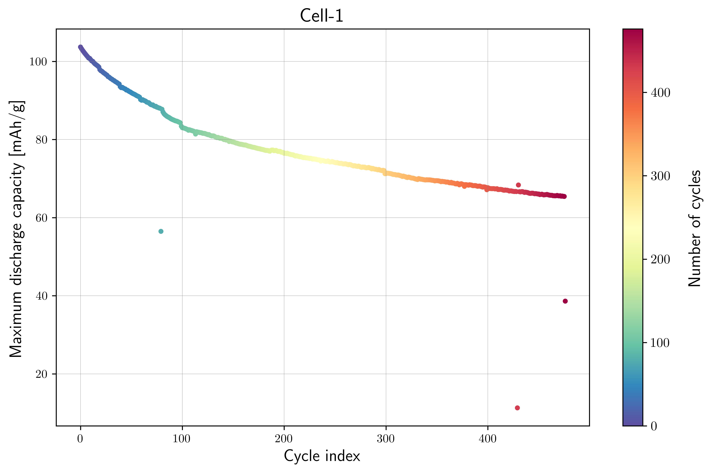
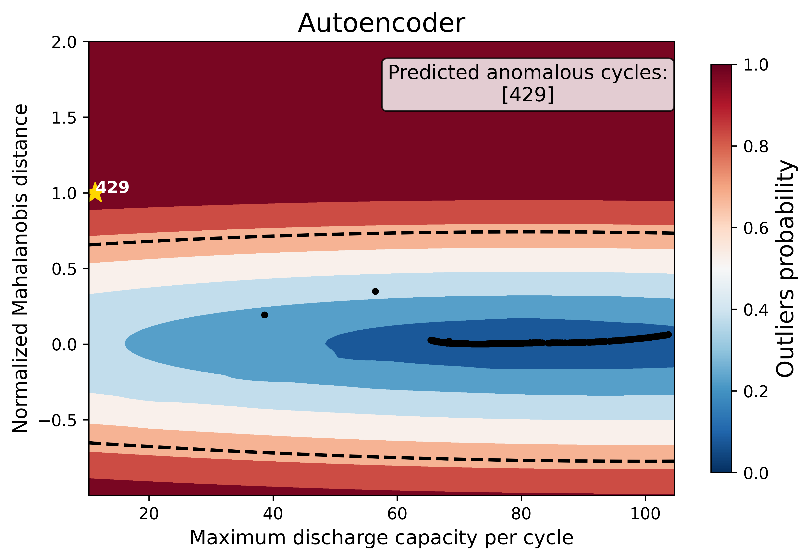
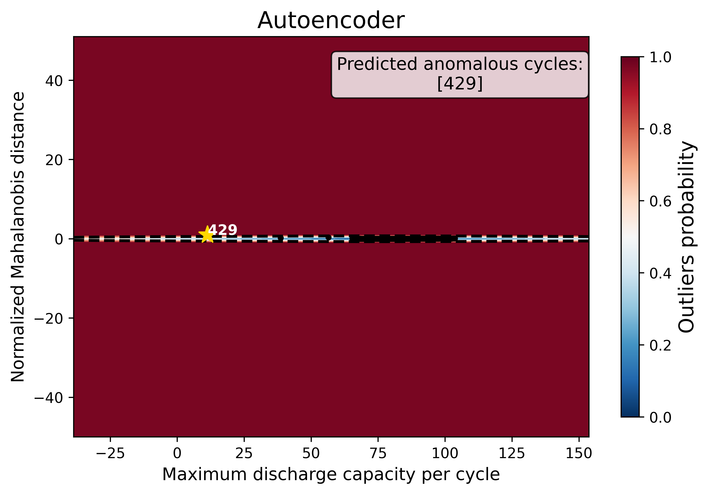
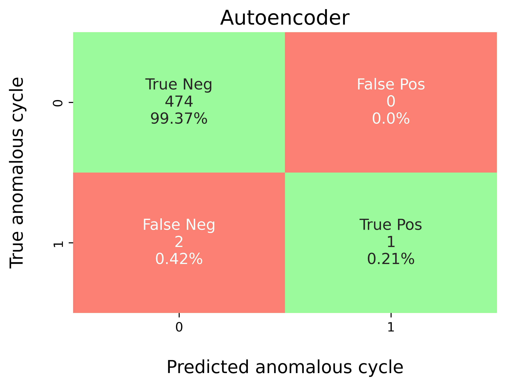
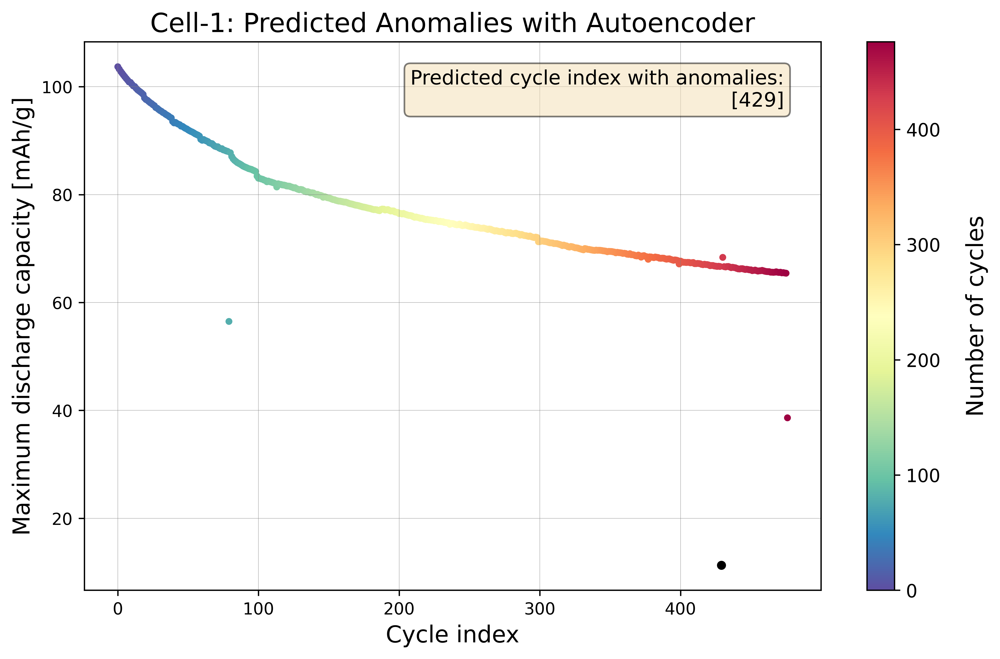

Example (3): Baseline Autoencoder without Hyperparameter Tuning (Tohoku Dataset)
==================================================================================

Prerequisites
---------------

* Python 3.12 (recommended)
* Files on disk:

  * ``database/tohoku_benchmark_dataset.db`` (benchmark labels per cycle)

* (Optional) LaTeX installation if you want Matplotlib to render text with
  LaTeX:

  * A TeX distribution (e.g., TeX Live/MacTeX/MiKTeX), dvipng, and fonts
    like cm-super.
  * Don't have LaTeX installed? Either install it, or set
    ``rcParams["text.usetex"] = False``.

Before running the example in the ``machine_learning/baseline_models``
section, please evaluate whether the global directory path specified in
``src/osbad/config.py`` needs to be updated:

.. code-block:: python

    # Modify this global directory path if needed
    PIPELINE_OUTPUT_DIR = Path.cwd().joinpath("artifacts_output_dir")

The following example of running a baseline Autoencoder model (without
hyperparameter tuning) is also provided as a notebook in
``machine_learning/baseline_models/tohoku_data_source/ml_06_autoencoder_baseline_tohoku.ipynb``.

Step-1: Load libraries
---------------------------

Import the libraries into your local development environment, including the
``osbad`` library for benchmarking anomaly detection.

* ``Path`` is used for robust, cross-platform file paths.
* ``pprint`` pretty-prints data structures for readable diagnostics.
* ``duckdb`` is the embedded analytical database engine storing the dataset.
* ``EmpiricalCovariance`` from sklearn is used to calculate Mahalanobis
  distance for feature engineering.
* ``bconf``: project config utilities (e.g., where to write artifacts).
* ``BenchDB``: a thin layer around DuckDB that provides convenience loaders.
* ``CycleScaling``: implements the statistical feature transformation
  methods for scaling cycle data.
* ``ModelRunner``, ``hp``, ``modval``, ``bviz``: modeling,
  hyperparameters, model validation, and visualization helpers for the
  benchmarking study.

.. code-block:: python

    # Standard library
    from pathlib import Path
    import pprint

    # Third-party libraries
    import duckdb
    import pandas as pd
    import matplotlib as mpl
    import matplotlib.pyplot as plt
    from matplotlib import rcParams
    from sklearn.covariance import EmpiricalCovariance

    # Custom osbad library for anomaly detection
    import osbad.config as bconf
    import osbad.hyperparam as hp
    import osbad.modval as modval
    import osbad.stats as bstats
    import osbad.viz as bviz
    from osbad.database import BenchDB
    from osbad.scaler import CycleScaling
    from osbad.model import ModelRunner

Step-2: Load Tohoku Benchmarking Dataset
-------------------------------------------

* Define the path to the DuckDB database file using the ``DB_DIR`` from
  ``bconf``.
* Create a DuckDB connection (read-only) and load the full Tohoku dataset
  from the ``df_tohoku_dataset`` table.
* Drop the additional index column automatically created by DuckDB.
* Retrieve the unique cell indices available in the dataset.

.. code-block:: python

    # Path to database directory
    DB_DIR = bconf.DB_DIR

    db_filepath = DB_DIR.joinpath("tohoku_benchmark_dataset.db")

    # Create a DuckDB connection
    con = duckdb.connect(
        db_filepath,
        read_only=True)

    # Load all training dataset from duckdb
    df_duckdb = con.sql(
        "SELECT * FROM df_tohoku_dataset").df()

    # Drop the additional index column
    df_duckdb = df_duckdb.drop(
        columns="__index_level_0__",
        errors="ignore")

    # Get the cell index of all dataset
    unique_cell_index = df_duckdb["cell_index"].unique()
    print(f"Unique cell index: {unique_cell_index}")

Step-3: Filter Dataset for a Selected Cell
---------------------------------------------

* Pick a specific cell based on ``selected_cell_label``, which identifies
  the experimental data corresponding to one unique cell.
* Create an artifacts folder for that cell, where you can save figures,
  tables, or model outputs related to this cell.
* Filter the loaded dataset for the selected cell only.
* Initialize ``BenchDB`` for the selected cell.

.. code-block:: python

    # Get the cell-ID from cell_inventory
    selected_cell_label = "cell_num_1"
    cell_num = selected_cell_label[-1]

    # Create a subfolder to store fig output
    # corresponding to each cell-index
    selected_cell_artifacts_dir = bconf.artifacts_output_dir(
        selected_cell_label)

    # Filter dataset for specific selected cell only
    df_selected_cell = df_duckdb[
        df_duckdb["cell_index"] == selected_cell_label]

    # Import the BenchDB class
    benchdb = BenchDB(
        db_filepath,
        selected_cell_label)

Step-4: Drop True Labels
-----------------------------

* Drop the true outlier labels (denoted as ``outlier``) from the dataframe,
  simulating a real-world scenario where ground truth is unknown during
  prediction.

.. code-block:: python

    # Drop the outlier labels
    df_selected_cell_without_labels = df_selected_cell.drop(
        "outlier", axis=1).reset_index(drop=True)

Step-5: Plot Capacity Fade Without Labels
--------------------------------------------

* Calculate the maximum discharge capacity per cycle to track capacity
  degradation over the battery's cycle life.
* Plot the capacity fade curve to visualize the battery's performance without
  showing anomaly labels. This represents what the model sees before
  training.

.. code-block:: python

    # Calculate maximum capacity per cycle
    max_cap_per_cycle = (
        df_selected_cell_without_labels
            .groupby(["cycle_index"])["discharge_capacity"].max())
    max_cap_per_cycle.name = "max_discharge_capacity"

    unique_cycle_index = (
        df_selected_cell_without_labels["cycle_index"].unique())

    axplot = bviz.plot_cycle_data(
        xseries=unique_cycle_index,
        yseries=max_cap_per_cycle,
        cycle_index_series=unique_cycle_index)

    axplot.set_xlabel(
        r"Cycle index",
        fontsize=14)
    axplot.set_ylabel(
        r"Maximum discharge capacity [mAh/g]",
        fontsize=14)

    axplot.set_title(
        f"Cell-{cell_num}",
        fontsize=16)

    output_fig_filename = (
        "cycling_data_without_labels_"
        + selected_cell_label
        + ".png")

    fig_output_path = (
        selected_cell_artifacts_dir
        .joinpath(output_fig_filename))

    plt.savefig(
        fig_output_path,
        dpi=600,
        bbox_inches="tight")

    plt.show()

Step-6: Feature Engineering with Mahalanobis Distance
-------------------------------------------------------

In the Tohoku dataset, we want to track the sudden and unintended capacity
drop over the cycle life. Therefore, the features used are:

* ``cycle_index``: Sequential cycle number
* ``max_discharge_capacity``: Maximum discharge capacity per cycle
* ``norm_mahal_dist``: Normalized Mahalanobis distance

The Mahalanobis distance is calculated from both the cycle index and the
maximum discharge capacity. It captures how far each cycle deviates from
the typical distribution of both features. Normalizing the Mahalanobis
distance ensures values are between 0 and 1.

Create Xdata for Mahalanobis distance calculation
^^^^^^^^^^^^^^^^^^^^^^^^^^^^^^^^^^^^^^^^^^^^^^^^^^^^

.. code-block:: python

    df_cycle_index = pd.Series(
        unique_cycle_index,
        name="cycle_index")

    # Input features for Mahalanobis distance
    df_features_per_cell = pd.concat(
        [df_cycle_index,
         max_cap_per_cycle],
        axis=1)

    Xfeat = df_features_per_cell.values

Normalized Mahalanobis distance
^^^^^^^^^^^^^^^^^^^^^^^^^^^^^^^^^^

.. code-block:: python

    # Calculate Mahalanobis distance based on cycle_index
    # and max_discharge_capacity
    cov = EmpiricalCovariance().fit(Xfeat)
    mahal_dist = cov.mahalanobis(Xfeat)

    df_maha_dist = pd.Series(
        mahal_dist,
        name="mahal_dist")

    # Merge calculated mahalanobis distance
    df_merge_features = pd.concat(
        [df_features_per_cell,
         df_maha_dist], axis=1)

    # Calculate maximum mahal_dist to
    # normalize the distance calculation
    max_mahal_dist = (
        df_merge_features["mahal_dist"].max())

    df_merge_features["norm_mahal_dist"] = (
        df_merge_features["mahal_dist"]/max_mahal_dist)

    selected_feature_cols = (
        "max_discharge_capacity",
        "norm_mahal_dist")

Step-7: Baseline Autoencoder (without hyperparameter tuning)
--------------------------------------------------------------

* Create a ``ModelRunner`` instance with the selected features
  (``max_discharge_capacity``, ``norm_mahal_dist``) and the cell label.
* Build the training input matrix ``Xdata``
  (shape: n_cycles × n_features).
* Instantiate the baseline Autoencoder model using
  ``cfg.baseline_model_param()`` (default hyperparameters, no tuning).
* Fit the model, compute probabilistic outlier scores, and extract the
  predicted outlier cycle indices using a threshold of ``0.7``.

.. code-block:: python

    # Instantiate ModelRunner with selected features and cell_label
    runner = ModelRunner(
        cell_label=selected_cell_label,
        df_input_features=df_merge_features,
        selected_feature_cols=selected_feature_cols
    )

    # create Xdata array
    Xdata = runner.create_model_x_input()

    # Extract the model configuration for Autoencoder
    cfg = hp.MODEL_CONFIG["autoencoder"]

    # create model instance without hyperparameter tuning
    model = cfg.baseline_model_param()
    model.fit(Xdata)

    # Predict probabilistic outlier score
    proba = model.predict_proba(Xdata)

    # Get predicted outlier cycle and score from
    # the probabilistic outlier score
    (pred_outlier_indices,
     pred_outlier_score) = runner.pred_outlier_indices_from_proba(
        proba=proba,
        threshold=0.7,
        outlier_col=cfg.proba_col
    )

    print("Predicted anomalous cycles:")
    print(pred_outlier_indices)
    print("-"*70)
    print("Predicted corresponding outlier score:")
    print(pred_outlier_score)

To inspect the default hyperparameters of the baseline model:

.. code-block:: python

    # Access the default hyperparameters without tuning
    baseline_model_param = model.get_params()
    pprint.pp(baseline_model_param)

Step-8: Predict Probabilistic Anomaly Score Map
--------------------------------------------------

* ``pred_outlier_indices`` is a list of cycle indices predicted as
  anomalous by the baseline Autoencoder model. Using ``.isin()``,
  the dataframe is filtered to keep only cycles identified as anomalies.
* A new column, ``outlier_prob``, is added to store the outlier probability
  computed by the model, making it easy to track how confidently the
  algorithm flags each cycle.
* ``runner.predict_anomaly_score_map`` generates a 2D contour map of
  anomaly scores (outlier probability).
* For the purpose of comparing different models using the same dataset, the
  ``grid_offset_size`` is set to 1. However, the contour map may not be
  partially shown for some models. In this case, the ``grid_offset_size``
  can be increased to a larger number to display the anomaly score map
  across wider grids.

Predict anomalous cycles
^^^^^^^^^^^^^^^^^^^^^^^^^^

.. code-block:: python

    df_outliers_pred = df_merge_features[
        df_merge_features["cycle_index"]
        .isin(pred_outlier_indices)].copy()

    df_outliers_pred["outlier_prob"] = pred_outlier_score

Anomaly score map (grid offset = 1)
^^^^^^^^^^^^^^^^^^^^^^^^^^^^^^^^^^^^^^

.. code-block:: python

    grid_offset_size = 1

    axplot = runner.predict_anomaly_score_map(
        selected_model=model,
        model_name="Autoencoder",
        xoutliers=df_outliers_pred["max_discharge_capacity"],
        youtliers=df_outliers_pred["norm_mahal_dist"],
        pred_outliers_index=pred_outlier_indices,
        threshold=0.7,
        square_grid=False,
        grid_offset=grid_offset_size
    )

    axplot.set_xlabel(
        r"Maximum discharge capacity per cycle",
        fontsize=12)
    axplot.set_ylabel(
        r"Normalized Mahalanobis distance",
        fontsize=12)

    output_fig_filename = (
        f"autoencoder_grid_offset_size_{grid_offset_size}_"
        + selected_cell_label
        + ".png")

    fig_output_path = (
        selected_cell_artifacts_dir
        .joinpath(output_fig_filename))

    plt.savefig(
        fig_output_path,
        dpi=600,
        bbox_inches="tight")

    plt.show()

Anomaly score map (grid offset = 50)
^^^^^^^^^^^^^^^^^^^^^^^^^^^^^^^^^^^^^^^

.. code-block:: python

    grid_offset_size = 50

    axplot = runner.predict_anomaly_score_map(
        selected_model=model,
        model_name="Autoencoder",
        xoutliers=df_outliers_pred["max_discharge_capacity"],
        youtliers=df_outliers_pred["norm_mahal_dist"],
        pred_outliers_index=pred_outlier_indices,
        threshold=0.7,
        square_grid=False,
        grid_offset=grid_offset_size
    )

    axplot.set_xlabel(
        r"Maximum discharge capacity per cycle",
        fontsize=12)
    axplot.set_ylabel(
        r"Normalized Mahalanobis distance",
        fontsize=12)

    output_fig_filename = (
        f"autoencoder_grid_offset_size_{grid_offset_size}_"
        + selected_cell_label
        + ".png")

    fig_output_path = (
        selected_cell_artifacts_dir
        .joinpath(output_fig_filename))

    plt.savefig(
        fig_output_path,
        dpi=600,
        bbox_inches="tight")

    plt.show()

The anomaly score map visualizes the Autoencoder model's decision boundary
in the two-dimensional feature space of maximum discharge capacity and
normalized Mahalanobis distance:

* **Background Heatmap**:

  * Red regions: high anomaly probability (more likely to contain outliers).
  * Blue/white regions: low anomaly probability (normal cycles).

* **Dashed Black Contour**:

  * Represents the decision boundary defined by the Autoencoder threshold.
    Points outside are considered anomalies.

* **Black Dots**:

  * Represent the majority of normal cycles (inlier data).

* **Yellow Stars with Labels**:

  * Mark the detected anomalous cycles. Their positions in the 2D feature
    space highlight where they deviate from typical battery behavior.

* **Colorbar (right)**:

  * Quantifies anomaly probability (0 = normal, 1 = highly anomalous).

Histogram of the anomaly score
^^^^^^^^^^^^^^^^^^^^^^^^^^^^^^^^

.. code-block:: python

    outlier_score = model.decision_function(Xdata)

    fig, ax = plt.subplots(figsize=(10, 6))

    ax.hist(
        outlier_score,
        color="skyblue",
        edgecolor="black",
        bins=25)

    ax.grid(
        color="grey",
        linestyle="-",
        linewidth=0.25,
        alpha=0.7)

    plt.show()

To access the threshold computed by the baseline model:

.. code-block:: python

    # threshold without hyperparameter tuning
    model.threshold_

Step-9: Model Performance Evaluation
-----------------------------------------

* Map predicted outlier indices to the benchmark dataset:

  * ``df_selected_cell`` holds cycle-level records and the ground-truth
    label (e.g., ``outlier`` = 1 for anomalous cycles, else 0).
  * ``pred_outlier_indices`` is the list of cycle indices flagged by the
    model.

* ``modval.evaluate_pred_outliers(...)`` returns a tidy DataFrame with:

  * ``cycle_index``: Cell discharge cycle index.
  * ``true_outlier``: ground truth (0/1).
  * ``pred_outlier``: model prediction (0/1) for the same cycles.

.. code-block:: python

    # Compare predicted probabilistic outliers against true outliers
    # from the benchmarking dataset
    df_eval_outlier = modval.evaluate_pred_outliers(
        df_benchmark=df_selected_cell,
        outlier_cycle_index=pred_outlier_indices)

Confusion matrix
^^^^^^^^^^^^^^^^^^

* ``modval.generate_confusion_matrix(...)`` aggregates counts of:

  * ``True Negative (TN)``: predicted 0, truth 0.
  * ``False Positive (FP)``: predicted 1, truth 0.
  * ``False Negative (FN)``: predicted 0, truth 1.
  * ``True Positive (TP)``: predicted 1, truth 1.

.. code-block:: python

    axplot = modval.generate_confusion_matrix(
        y_true=df_eval_outlier["true_outlier"],
        y_pred=df_eval_outlier["pred_outlier"])

    axplot.set_title(
        "Autoencoder",
        fontsize=16)

    output_fig_filename = (
        "conf_matrix_autoencoder_"
        + selected_cell_label
        + ".png")

    fig_output_path = (
        selected_cell_artifacts_dir
        .joinpath(output_fig_filename))

    plt.savefig(
        fig_output_path,
        dpi=600,
        bbox_inches="tight")

    plt.show()

Evaluation metrics
^^^^^^^^^^^^^^^^^^^^

In this study, five different metrics are used to evaluate model performance:

* **Accuracy**: :math:`\frac{\textrm{TP} + \textrm{TN}}{\textrm{Total prediction}}`
* **Precision**: :math:`\frac{\textrm{TP}}{\textrm{TP + FP}}`
* **Recall**: :math:`\frac{\textrm{TP}}{\textrm{TP + FN}}`
* **F1-score**: :math:`\frac{2(\textrm{Precision}\times \textrm{Recall})}{\textrm{Precision} + \textrm{Recall}}`
* **MCC**: :math:`\frac{TP \times TN - FP \times FN}{\sqrt{(TP + FP)(TP + FN)(TN + FP)(TN+FN)}}`

.. code-block:: python

    df_current_eval_metrics = modval.eval_model_performance(
        model_name="autoencoder",
        selected_cell_label=selected_cell_label,
        df_eval_outliers=df_eval_outlier)

Step-10: Export Evaluation Metrics
-------------------------------------

* Export the evaluation metrics to a CSV file for record-keeping and
  comparison across models.

.. code-block:: python

    # Export current metrics to CSV
    hyperparam_eval_filepath = Path.cwd().joinpath(
        "eval_metrics_no_hp_tohoku.csv")

    hp.export_current_model_metrics(
        model_name="autoencoder",
        selected_cell_label=selected_cell_label,
        df_current_eval_metrics=df_current_eval_metrics,
        export_csv_filepath=hyperparam_eval_filepath,
        if_exists="replace")

Step-11: Visualize Predicted Anomalies
-----------------------------------------

* Plot the capacity fade curve with predicted anomalies highlighted.
* Annotate the anomalous cycle indices on the plot.
* This visualization helps interpret where the model detected sudden capacity
  drops, which may indicate battery degradation events.

.. code-block:: python

    pred_cap_outlier = max_cap_per_cycle[
        max_cap_per_cycle
            .index.isin(pred_outlier_indices)]

    # Reset the sns settings
    mpl.rcParams.update(mpl.rcParamsDefault)

    axplot = bviz.plot_cycle_data(
        xseries=unique_cycle_index,
        yseries=max_cap_per_cycle,
        cycle_index_series=unique_cycle_index,
        xoutlier=pred_cap_outlier.index,
        youtlier=pred_cap_outlier)

    axplot.set_xlabel(
        r"Cycle index",
        fontsize=14)
    axplot.set_ylabel(
        r"Maximum discharge capacity [mAh/g]",
        fontsize=14)

    # Create textbox to annotate anomalous cycle
    textstr = '\n'.join((
        r"Predicted cycle index with anomalies:",
        f"{pred_outlier_indices}"))

    # properties for bbox
    props = dict(
        boxstyle='round',
        facecolor='wheat',
        alpha=0.5)

    # first 0.95 corresponds to the left right alignment starting
    # from left, second 0.95 corresponds to up down alignment
    # starting from bottom
    axplot.text(
        0.95, 0.95,
        textstr,
        transform=axplot.transAxes,
        fontsize=12,
        # ha means right alignment of the text
        ha="right", va='top',
        bbox=props)

    axplot.set_title(
        f"Cell-{cell_num}: Predicted Anomalies with Autoencoder",
        fontsize=16)

    output_fig_filename = (
        "autoencoder_cycling_data_with_pred_outliers_"
        + selected_cell_label
        + ".png")

    fig_output_path = (
        selected_cell_artifacts_dir
        .joinpath(output_fig_filename))

    plt.savefig(
        fig_output_path,
        dpi=600,
        bbox_inches="tight")

    plt.show()

The figure shows the capacity fade curve with predicted anomalies highlighted.
These sudden capacity drops indicate potential degradation events in the
solid-state battery, which could be caused by:

* Electrolyte decomposition
* Interface resistance increase
* Mechanical damage to the solid electrolyte
* Lithium plating

The Autoencoder model detects these point anomalies by reconstructing the
input features and flagging cycles with high reconstruction error as
anomalies. No hyperparameter tuning is applied in this baseline model,
so the results may not be optimal. However, it provides a starting point for
understanding how the model identifies anomalous cycles based on the feature
space of maximum discharge capacity and normalized Mahalanobis distance.