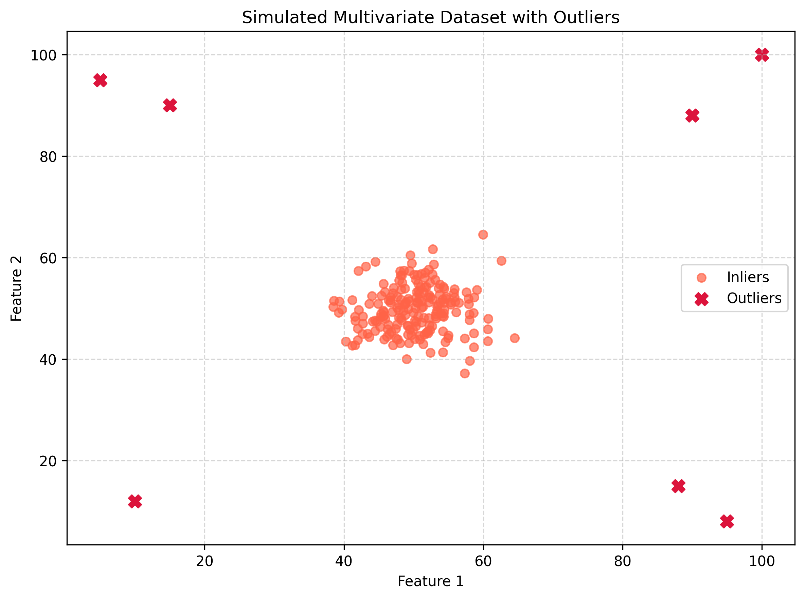
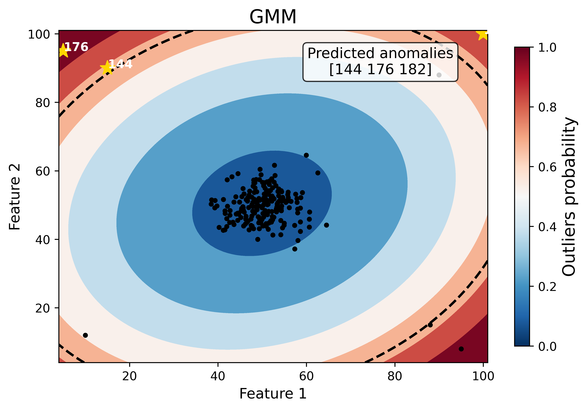
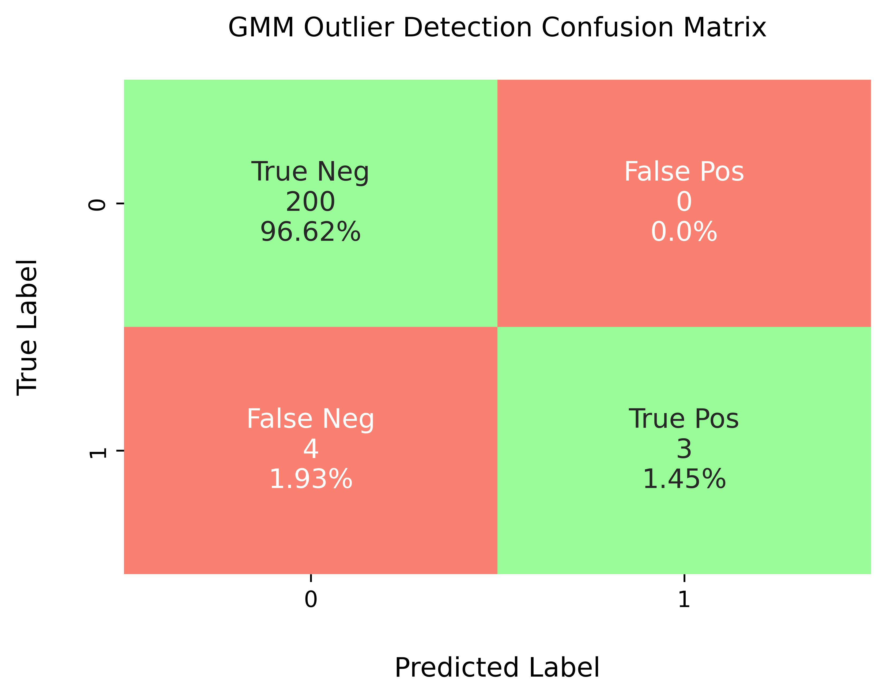

Example (7): Baseline Gaussian Mixture Model (GMM) without Hyperparameter Tuning (Synthetic Dataset)
=====================================================================================================

Prerequisites
---------------

* Python 3.12 (recommended)
* Files on disk:

  * ``machine_learning/baseline_models/synthetic_outliers/multivariate_dataset.csv``
    (the pre-generated synthetic multivariate dataset)

* (Optional) LaTeX installation if you want Matplotlib to render text with
  LaTeX:

  * A TeX distribution (e.g., TeX Live/MacTeX/MiKTeX), dvipng, and fonts
    like cm-super.
  * Don't have LaTeX installed? Either install it, or set
    ``rcParams["text.usetex"] = False``.

Before running the example in the ``machine_learning/baseline_models``
section, please evaluate whether the global directory path specified in
``src/osbad/config.py`` needs to be updated:

.. code-block:: python

    # Modify this global directory path if needed
    PIPELINE_OUTPUT_DIR = Path.cwd().joinpath("artifacts_output_dir")

This example illustrates how **osbad** generalizes beyond the Severson and
Tohoku battery datasets. The synthetic multivariate dataset is deliberately
decoupled from any specific battery chemistry or application. Because the
Gaussian Mixture Model (GMM) operates on generic feature vectors, the same
workflow can be applied to entirely new chemistries, materials, and
applications without modification.

The following example of running a baseline GMM model (without hyperparameter
tuning) is also provided as a notebook in
``machine_learning/baseline_models/synthetic_outliers/ml_03_gmm_baseline_synthetic.ipynb``.

Step-1: Load libraries
---------------------------

Import the libraries into your local development environment, including the
``osbad`` library for benchmarking anomaly detection.

* ``Path`` is used for robust, cross-platform file paths.
* ``pprint`` pretty-prints data structures for readable diagnostics.
* ``pandas`` and ``numpy`` handle the tabular dataset and array operations.
* ``bconf``: project config utilities (e.g., where to write artifacts).
* ``ModelRunner``, ``hp``, ``modval``, ``bviz``: modeling,
  hyperparameters, model validation, and visualization helpers for the
  benchmarking study.

.. code-block:: python

    # Standard library
    from pathlib import Path
    import pprint

    # Third-party libraries
    import pandas as pd
    import matplotlib as mpl
    import matplotlib.pyplot as plt
    import numpy as np

    # Custom osbad library for anomaly detection
    import osbad.config as bconf
    import osbad.hyperparam as hp
    import osbad.modval as modval
    import osbad.viz as bviz
    from osbad.model import ModelRunner

Step-2: Load the Synthetic Multivariate Dataset
--------------------------------------------------

* Read the pre-generated 2D dataset from ``multivariate_dataset.csv``. It
  contains 207 samples with an ``index``, ``feature_1``, and ``feature_2``
  column.
* Because the CSV does not store the labels, the ground-truth outliers are
  recovered by matching the known injected outlier coordinates against the
  loaded rows. Their ``index`` values (``true_outlier_index``) then serve as
  the ground-truth labels for evaluating the GMM detector.

.. code-block:: python

    # Load the pre-generated synthetic dataset
    df_multivariate = pd.read_csv("multivariate_dataset.csv")

    # The known outlier coordinates injected when the dataset was created
    injected_outliers = np.array([
        [10, 12],
        [90, 88],
        [5, 95],
        [95, 8],
        [15, 90],
        [88, 15],
        [100, 100],
    ])

    # Recover the ground-truth outlier index by matching injected coordinates
    features = df_multivariate[["feature_1", "feature_2"]].to_numpy()
    is_outlier_mask = np.any(
        np.all(features[:, None, :] == injected_outliers[None, :, :], axis=2),
        axis=1)

    true_outlier_index = df_multivariate.loc[
        is_outlier_mask, "index"].to_numpy()

    print(f"Number of samples: {df_multivariate.shape[0]}")
    print(f"Number of injected outliers: {true_outlier_index.size}")
    print(f"Injected outlier index: {true_outlier_index.tolist()}")
    df_multivariate.describe()

Step-3: Plot the Synthetic Dataset
-------------------------------------

* Visualize the compact inlier cluster (tomato) together with the injected
  multivariate outliers (crimson crosses) scattered around the edges of the
  feature space. Since the injected outliers are known in advance, they serve
  as the ground truth for benchmarking.

.. code-block:: python

    # Plot the multivariate dataset, highlighting the injected outliers
    is_outlier = df_multivariate["index"].isin(true_outlier_index)

    fig, ax = plt.subplots(figsize=(8, 6))
    mpl.rcParams.update(mpl.rcParamsDefault)

    ax.scatter(
        df_multivariate.loc[~is_outlier, "feature_1"],
        df_multivariate.loc[~is_outlier, "feature_2"],
        color="tomato",
        label="Inliers",
        alpha=0.7)
    ax.scatter(
        df_multivariate.loc[is_outlier, "feature_1"],
        df_multivariate.loc[is_outlier, "feature_2"],
        color="crimson",
        label="Outliers",
        marker="X",
        s=80)

    ax.grid(True, linestyle="--", alpha=0.5)
    ax.set_xlabel("Feature 1")
    ax.set_ylabel("Feature 2")
    ax.set_title("Simulated Multivariate Dataset with Outliers")
    ax.legend()
    plt.tight_layout()
    plt.show()

Step-4: Baseline GMM (without hyperparameter tuning)
------------------------------------------------------

The GMM outlier detector fits a mixture of Gaussians to the data and scores
each sample by its likelihood under the fitted density: points that fall in
low-density regions receive higher anomaly scores. Here the two synthetic
features are used directly as model inputs through the OSBAD ``ModelRunner``.

* Create a ``ModelRunner`` instance with the selected features
  (``feature_1``, ``feature_2``) and a label used to organize the figure
  output.
* Build the training input matrix ``Xdata``
  (shape: n_samples × n_features).
* Instantiate the baseline GMM model using
  ``cfg.baseline_model_param()`` (default hyperparameters, no tuning).
* Fit the model, compute probabilistic outlier scores, and extract the
  predicted outlier indices using a threshold of ``0.7``.

.. code-block:: python

    # Label used to organize the figure output for this synthetic dataset
    selected_cell_label = "synthetic_multivariate"

    # Create a subfolder to store fig output
    selected_cell_artifacts_dir = bconf.artifacts_output_dir(
        selected_cell_label)

    # Use both synthetic features as model inputs
    selected_feature_cols = (
        "feature_1",
        "feature_2")

    # Instantiate ModelRunner with selected features and label
    runner = ModelRunner(
        cell_label=selected_cell_label,
        df_input_features=df_multivariate,
        selected_feature_cols=selected_feature_cols
    )

    # create Xdata array
    Xdata = runner.create_model_x_input()

    # Extract the model configuration for GMM
    cfg = hp.MODEL_CONFIG["gmm"]

    # create model instance without hyperparameter tuning
    model = cfg.baseline_model_param()
    model.fit(Xdata)

    # Predict probabilistic outlier score
    proba = model.predict_proba(Xdata)

    # Get predicted outlier index and score from
    # the probabilistic outlier score
    (pred_outlier_indices,
     pred_outlier_score) = runner.pred_outlier_indices_from_proba(
        proba=proba,
        threshold=0.7,
        outlier_col=cfg.proba_col
    )

    print("Predicted outlier index:")
    print(pred_outlier_indices)
    print("-"*70)
    print("Predicted corresponding outlier score:")
    print(pred_outlier_score)

To inspect the default hyperparameters of the baseline model:

.. code-block:: python

    # Access the default hyperparameters without tuning
    baseline_model_param = model.get_params()
    pprint.pp(baseline_model_param)

Step-5: Predict Probabilistic Anomaly Score Map
--------------------------------------------------

* ``pred_outlier_indices`` is a list of sample indices predicted as anomalous
  by the baseline GMM model. Using ``.isin()``, the dataframe is filtered to
  keep only samples identified as anomalies.
* A new column, ``outlier_prob``, is added to store the outlier probability
  computed by the model, making it easy to track how confidently the
  algorithm flags each sample.
* ``runner.predict_anomaly_score_map`` generates a 2D contour map of anomaly
  scores (outlier probability).

.. code-block:: python

    # Filter the samples based on predicted outlier indices
    df_outliers_pred = df_multivariate[
        df_multivariate["index"]
        .isin(pred_outlier_indices)].copy()

    df_outliers_pred["outlier_prob"] = pred_outlier_score

    # Plot the anomaly score map
    axplot = runner.predict_anomaly_score_map(
        selected_model=model,
        model_name="GMM",
        xoutliers=df_outliers_pred["feature_1"],
        youtliers=df_outliers_pred["feature_2"],
        pred_outliers_index=pred_outlier_indices,
        threshold=0.7,
        annotation_label="Predicted anomalies"
    )

    axplot.set_xlabel(
        r"Feature 1",
        fontsize=12)
    axplot.set_ylabel(
        r"Feature 2",
        fontsize=12)

    output_fig_filename = (
        "anomaly_score_map_gmm_"
        + selected_cell_label
        + ".png")

    fig_output_path = (
        selected_cell_artifacts_dir
        .joinpath(output_fig_filename))

    plt.savefig(
        fig_output_path,
        dpi=600,
        bbox_inches="tight")

    plt.show()

The figure shows the anomaly score map produced by the baseline GMM model:

* **Background Heatmap**:

  * Red regions: high anomaly probability (more likely to contain outliers).
  * Blue/white regions: low anomaly probability (normal samples).

* **Dashed Black Contour**:

  * Represents the decision boundary defined by the GMM threshold. Points
    outside are considered anomalies.

* **Black Dots**:

  * Represent the majority of normal samples (inlier data).

* **Yellow Stars with Labels**:

  * Mark the detected anomalous samples. Their positions in the 2D feature
    space highlight where they deviate from the compact inlier cluster.

* **Colorbar (right)**:

  * Quantifies anomaly probability (0 = normal, 1 = highly anomalous).

Histogram of the anomaly score
^^^^^^^^^^^^^^^^^^^^^^^^^^^^^^^^

.. code-block:: python

    outlier_score = model.decision_function(Xdata)

    fig, ax = plt.subplots(figsize=(10, 6))

    ax.hist(
        outlier_score,
        color="skyblue",
        edgecolor="black",
        bins=25)

    ax.set_xlabel(
        "Predicted anomaly score",
        fontsize=12)

    ax.grid(
        color="grey",
        linestyle="-",
        linewidth=0.25,
        alpha=0.7)

    plt.show()

To access the threshold computed by the baseline model:

.. code-block:: python

    # threshold without hyperparameter tuning
    model.threshold_

Step-6: Model Performance Evaluation
-----------------------------------------

* The predicted outliers are compared against the injected ground-truth
  outliers. Both label vectors are aligned on the sample ``index``.

  * ``true_outlier_index`` holds the ground-truth injected outlier indices.
  * ``pred_outlier_indices`` is the list of sample indices flagged by the
    model.

.. code-block:: python

    # Compare predicted outliers with the true injected outliers
    y_true = df_multivariate["index"].isin(true_outlier_index)
    y_pred = df_multivariate["index"].isin(pred_outlier_indices)

Confusion matrix
^^^^^^^^^^^^^^^^^^

* The confusion matrix aggregates counts of:

  * ``True Negative (TN)``: predicted 0, truth 0.
  * ``False Positive (FP)``: predicted 1, truth 0.
  * ``False Negative (FN)``: predicted 0, truth 1.
  * ``True Positive (TP)``: predicted 1, truth 1.

.. code-block:: python

    # Generate custom confusion matrix
    axplot = modval.generate_confusion_matrix(
        y_true=np.array(y_true),
        y_pred=np.array(y_pred))

    axplot.set_xlabel("Predicted Label", fontsize=12)
    axplot.set_ylabel("True Label", fontsize=12)

    axplot.set_title(
        "GMM Outlier Detection Confusion Matrix"
        + "\n",
        fontsize=12)

    output_fig_filename = (
        "conf_matrix_gmm_"
        + selected_cell_label
        + ".png")

    fig_output_path = (
        selected_cell_artifacts_dir
        .joinpath(output_fig_filename))

    plt.savefig(
        fig_output_path,
        dpi=600,
        bbox_inches="tight")

    plt.show()

Evaluation metrics
^^^^^^^^^^^^^^^^^^^^

In this study, five different metrics are used to evaluate model performance:

* **Accuracy**: :math:`\frac{\textrm{TP} + \textrm{TN}}{\textrm{Total prediction}}`
* **Precision**: :math:`\frac{\textrm{TP}}{\textrm{TP + FP}}`
* **Recall**: :math:`\frac{\textrm{TP}}{\textrm{TP + FN}}`
* **F1-score**: :math:`\frac{2(\textrm{Precision}\times \textrm{Recall})}{\textrm{Precision} + \textrm{Recall}}`
* **MCC**: :math:`\frac{TP \times TN - FP \times FN}{\sqrt{(TP + FP)(TP + FN)(TN + FP)(TN+FN)}}`

The per-sample evaluation dataframe is assembled to match the column layout
expected by ``modval.eval_model_performance``:

.. code-block:: python

    # Assemble the per-sample evaluation dataframe
    df_eval_outlier = pd.DataFrame({
        "cycle_index": df_multivariate["index"],
        "true_outlier": np.array(y_true, dtype=int),
        "pred_outlier": np.array(y_pred, dtype=int),
    })

    df_current_eval_metrics = modval.eval_model_performance(
        model_name="gmm",
        selected_cell_label=selected_cell_label,
        df_eval_outliers=df_eval_outlier)

    df_current_eval_metrics

Step-7: Export Evaluation Metrics
------------------------------------

* Export the evaluation metrics to a CSV file for record-keeping and
  comparison across models.

.. code-block:: python

    # Export current metrics to CSV
    metrics_eval_filepath = Path.cwd().joinpath(
        "eval_metrics_no_hp_synthetic.csv")

    hp.export_current_model_metrics(
        model_name="gmm",
        selected_cell_label=selected_cell_label,
        df_current_eval_metrics=df_current_eval_metrics,
        export_csv_filepath=metrics_eval_filepath,
        if_exists="replace")
