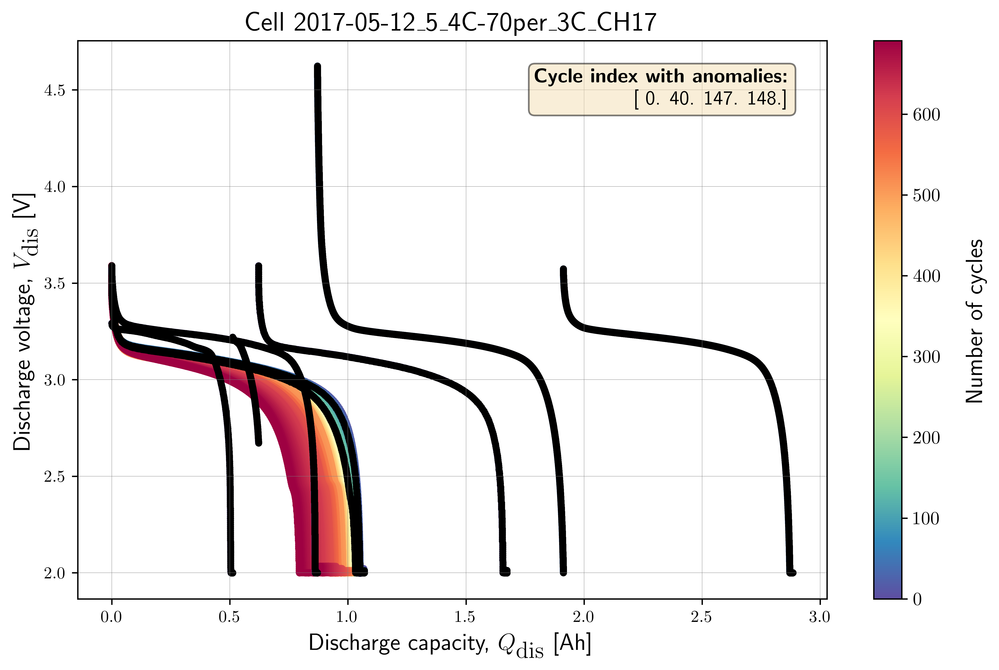

MIT/Stanford Data-driven Prediction of Battery Cycle Life Dataset
####################################################################

The first dataset used in this project is extracted from the publication by

   Severson, K.A., Attia, P.M., Jin, N. et al. Data-driven prediction of
   battery cycle life before capacity degradation.
   Nat Energy 4, 383–391 (2019). https://doi.org/10.1038/s41560-019-0356-8

The raw dataset was found to be contaminated with different anomalies.
Due to the large number of cells used for the experiments in their works,
we have only used the experimental dataset from 46 cells in this study.
Each cell has an average of 845 cycles, which is more than sufficient for
benchmarking anomaly detection algorithms in the present study.
In addition, we have also enriched the raw dataset by manually
labelling normal (denoted as 0) vs anomalous cycle (denoted as 1)
for each cycle in these 46 cells. The outliers that we have labelled
manually were provided in the ``cycle_outlier_inventory.csv``.

Dataset Information 
==========================

* **Total number of cells**: 46
* **Number of cells for Training** (``train_dataset_severson.db``): 23
* **Number of cells for Testing** (``test_dataset_severson.db``): 23
* **Average number of cycles for each cell**: 845
* **File format**: SQLite database file (.db)
* **File Size**: Training set - 195 Mb, Test set-169 Mb 
* **Missing values**:
* **Target variable**:

The features used for anomaly detection were further extracted and saved in 
another database, so that the pipeline can be automated for all cells in a 
leaner manner. The same protocols used for creating the training features are 
applied to create the test features.

Standard Schema
==========================
* ``test_time``: Experimental test time in [seconds];
* ``cycle_index``: Discharge cycle index of the experiment;
* ``cell_index``: Identifier for the tested cell;
* ``voltage``: Measured voltage during the experiment in [V];
* ``discharge_capacity``: Cell discharge capacity measured in [Ah];
* ``current``: Applied at the given test step measured in [A];
* ``internal_resistance``: Measured internal resistance of the system [Ohm];
* ``temperature``: Recorded temperature during the experiment in [°C];
* ``outlier``: Boolean flag (0/1) marking whether the data point is an
  outlier;

Features Description 
==========================

+---------------------+------------+----------+----------+
| Feature             | Type       | Description | Range/Values | Utility for Anomaly Detection|
+=====================+============+==========+==========+
|  test_time          |            | column 3 | column 4 |
+---------------------+------------+----------+----------+
| cycle_index         | ...        | ...      |          |
+---------------------+------------+----------+----------+
| voltage	          | ...        | ...      |          |
+---------------------+------------+----------+----------+
| discharge_capacity	 | ...        | ...      |          |
+---------------------+------------+----------+----------+
| current             | ...        | ...      |          |
+---------------------+------------+----------+----------+
| internal_resistance | ...        | ...      |          |
+---------------------+------------+----------+----------+
| temperature         | ...        | ...      |          |
+---------------------+------------+----------+----------+
| outlier             | ...        | ...      |          |
+---------------------+------------+----------+----------+

Minimal Example
=================

.. code-block:: python

   # STEP-1: LOAD LIBRARIES
   # Standard library
   import os
   from pathlib import Path

   # Third-party libraries
   import duckdb

   # Custom osbad library for anomaly detection
   import osbad.config as bconf
   from osbad.database import BenchDB

   # -------------------------------------------------------------------------
   # STEP-2: LOAD CELL INVENTORY FOR CELL_INDEX

   # Path to the DuckDB instance:
   # "train_dataset_severson.db"
   db_filepath = (
      Path.cwd()
      .parent
      .joinpath("database","train_dataset_severson.db"))

   # Create a DuckDB connection
   con = duckdb.connect(
      db_filepath,
      read_only=True)

   # Load all training dataset from duckdb
   df_duckdb = con.execute(
      "SELECT * FROM df_train_dataset_sv").fetchdf()

   unique_cell_index_train = df_duckdb["cell_index"].unique()
   print(unique_cell_index_train)

   # Get the cell-ID from unique_cell_index_train
   selected_cell_label = "2017-05-12_5_4C-70per_3C_CH17"

   # Create a subfolder to store fig output
   # corresponding to each cell-index
   selected_cell_artifacts_dir = bconf.artifacts_output_dir(
      selected_cell_label)

   # -------------------------------------------------------------------------
   # STEP-3: LOAD BENCHMARKING DATASET

   # Import the BenchDB class
   # Load only the dataset based on the selected cell
   benchdb = BenchDB(
      db_filepath,
      selected_cell_label)

   # load the benchmarking dataset
   df_selected_cell = benchdb.load_benchmark_dataset(
      dataset_type="train")

   if df_selected_cell is not None:

      filter_col = [
         "cell_index",
         "cycle_index",
         "discharge_capacity",
         "voltage"]

      # Drop true labels from the benchmarking dataset
      # and filter for selected columns only
      df_selected_cell_without_labels = benchdb.drop_labels(
         df_selected_cell,
         filter_col)

      # Extract true outliers cycle index from benchmarking dataset
      true_outlier_cycle_index = benchdb.get_true_outlier_cycle_index(
         df_selected_cell)
      print(f"True outlier cycle index:")
      print(true_outlier_cycle_index)

   # -------------------------------------------------------------------------
   # STEP-4: PLOT CYCLING DATASET

   # Plot cell data with true anomalies
   # If the true outlier cycle index is not known,
   # cycling data will be plotted without labels
   benchdb.plot_cycle_data(
      df_selected_cell_without_labels,
      true_outlier_cycle_index)

