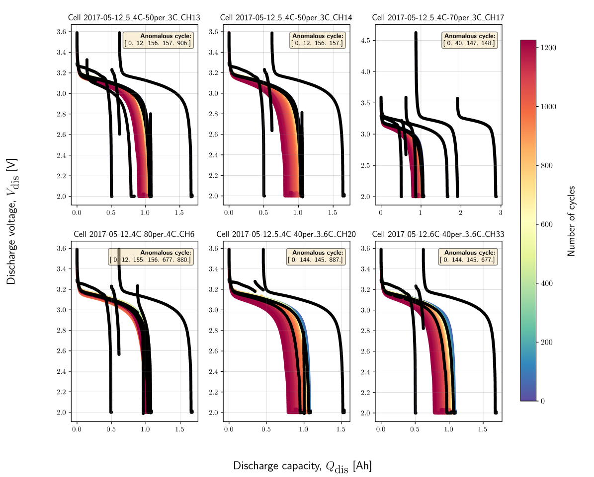

MIT/Stanford Data-driven Prediction of Battery Cycle Life Dataset
####################################################################

The raw dataset was found to be contaminated with different anomalies.
Due to the large number of cells used for the experiments in their works,
we have only used the experimental dataset from 46 cells in this study.
Each cell has an average of 845 cycles, which is more than sufficient for
benchmarking anomaly detection algorithms in the present study.
In addition, we have also enriched the raw dataset by manually
labelling normal (denoted as 0) vs anomalous cycle (denoted as 1)
for each cycle across all 46 cells.

Battery Chemistry Description
==============================

.. list-table::
   :header-rows: 1
   :widths: 30 70

   * - Property
     - MIT/Stanford
   * - Positive electrode
     - LFP (LiFePO₄)
   * - Electrolyte
     - Liquid electrolyte
   * - Negative electrode
     - Graphite
   * - Number of cells
     - 46 cells
   * - Nominal capacity
     - 1.1 Ah
   * - Discharging C-rates
     - 4 C (1C ≈ 1.1 A)
   * - ΔSOC in %
     - 100%
   * - Theoretical voltage limits
     - 2.0 V - 3.6 V
   * - Operating temperature
     - 30 °C
   * - Anomalous data type
     - Discharge-capacity profile
   * - Data source
     - Severson et al.

Train and Test Dataset
==========================

The dataset from 46 cells is split into training dataset
(``train_dataset_severson.db``) and test dataset
(``test_dataset_severson.db``). The features used for anomaly
detection were further extracted and saved in another database,
so that the pipeline can be automated for all cells in a leaner manner.
The same protocols used for creating the training features are applied to
create the test features.

Dataset Information 
==========================

* **Total number of cells**: 46
* **Number of cells for Training** (``train_dataset_severson.db``): 23
* **Number of cells for Testing** (``test_dataset_severson.db``): 23
* **Average number of cycles for each cell**: 845 (Maximum: 1226, Minimum: 648)
* **File format**: SQLite database file (.db)
* **File Size**: Training set - 195 Mb, Test set-169 Mb 
* **Missing values**: None (100% complete dataset)
* **Target variable**: ``outlier`` (1 for outlier, 0 for normal cycle)

Features Description 
==========================

**Using cell:** ``2017-05-12_5_4C-70per_3C_CH17`` **as an example.**

.. list-table:: Feature Details
   :header-rows: 1
   :widths: 20 10 40 15 15

   * - Feature
     - Type
     - Description
     - Range/Values
     - Anomaly Relevance
   * - ``test_time``
     - Float
     - Experimental test time in [seconds]
     - 0 - 390923.69
     - Low
   * - ``cycle_index``
     - Integer
     - Discharge cycle index of the experiment
     - 0 - 691
     - Low
   * - ``cell_index``
     - String
     - Identifier for the tested cell
     - -
     - -
   * - ``voltage``
     - Float
     - Measured voltage during the experiment in [V]
     - 1.99 - 4.62
     - High
   * - ``discharge_capacity``
     - Float
     - Cell discharge capacity measured in [Ah]
     - 0 - 2.88
     - High
   * - ``current``
     - Float
     - Current applied at the given test step measured in [A]
     - -4.40 – -0.02
     - Medium
   * - ``internal_resistance``
     - Float
     - Measured internal resistance of the system [Ohm]
     - 0.01 - 0.02
     - Medium
   * - ``temperature``
     - Float
     - Recorded temperature during the experiment in [°C]
     - 25.14 - 39.73
     - Medium
   * - ``outlier``
     - Bool
     - Boolean flag (0/1) marking whether the data point is an outlier
     - 0, 1
     - TARGET VARIABLE

Data Quality Assessment
==========================

- Zero missing values across all datasets for 46 Cells, all cycles and 9 
  features.
- 100% data completeness ensures robust model training and validation.
- 0.47% positive cases on average for each cell (outlier cycles). This makes
  it a highly imbalanced anolmaly detection problem.
- 0 duplicate or corrupted records.
- 0 bad outlier label values.
- 103 observations where voltage is outside chemistry limits [0.1, 4.5]
- 0 observations where temperature is outside safe range (-40°C to 90°C).
- 40 observations where internal resistance ≤ 0.
- 0 observations with ≤ 0 discharge capacity. 
- Wide range of cycle numbers (1226-648) in training cells for better
  generalization and validation for different test datasets.
- Wide range of experimental test time for train cells from 108 - 252 hrs.
- Major and Minor anomalous cycles included in the dataset.

Sample Dataset for Cell ``2017-05-12_5_4C-70per_3C_CH17``
==========================================================

.. note::
   Only the first 50 rows are shown here to give a feel for the data.
   See the repository for the full dataset.

.. .. figure:: docs_figure/hist_features.png
..    :alt: Histogram of features
..    :align: center
..    :figwidth: 200%

.. raw:: html

   

.. raw:: html
   :file: sample_data/severson_sample.html

.. raw:: html

   

Citation
========

   Severson, K.A., Attia, P.M., Jin, N. et al. Data-driven prediction of
   battery cycle life before capacity degradation.
   Nat Energy 4, 383–391 (2019). https://doi.org/10.1038/s41560-019-0356-8

