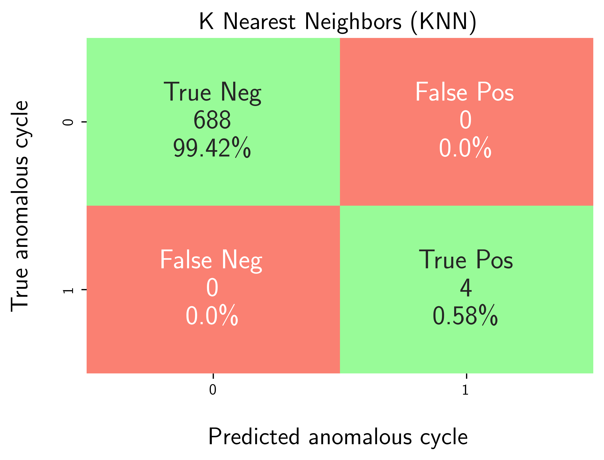

Example: Benchmarking K-Nearest Neighbors with Hyperparameter Tuning using Proxy Evaluation Metrics
===================================================================================================

This example illustrates how to leverage the capabilities of **osbad** for 
hyperparameter tuning in unsupervised anomaly detection models when **no 
prior labeled training** data is available. In such scenarios, traditional 
hyperparameter optimization methods based on transfer learning cannot be 
directly applied. Consequently, the objective function must be redefined 
because conventional outlier detection metrics, such as precision and recall, 
are not meaningful during the tuning process. To address this, a surrogate 
multivariate regression model is utilized to estimate model performance
using alternative indicators like regression loss and inlier count score. 
These serve as practical substitutes in the absence of ground-truth labels.
The underlying principle is that if the anomaly detection model effectively
isolates outliers, the remaining inlier data should exhibit a more coherent
structure, resulting in improved regression loss.

The following example of running a hyperparameter tuning and anomaly detection
pipeline is also provided as a notebook in 
``quick_start_tutorials/04_knn_hpt_proxy_regr.ipynb``.

Step-1: Load libraries
---------------------------

Import the libraries into your local development environment, including the
``osbad`` library for benchmarking anomaly detection.

* ``Path`` is used for robust, cross-platform file paths.
* ``duckdb`` is the embedded analytical database engine storing the dataset.
* ``fireducks.pandas as pd`` gives you a pandas-compatible API;
  you can usually treat it like import pandas as pd.
* ``optuna`` for automated hyperparameter optimization that uses efficient
  algorithms like Bayesian optimization to find the best parameter settings.
* ``rcParams["text.usetex"] = True`` tells Matplotlib to render text via
  LaTeX. If you don’t have LaTeX installed, flip this to False.
* ``bconf``: project config utilities (e.g., where to write artifacts).
* ``BenchDB``: a thin layer around DuckDB that provides convenience loaders.
* ``ModelRunner``, ``hp``, ``modval``: modeling, hyperparameters, and
  model validation helpers for benchmarking study in this project.

.. code-block:: python

  # Standard library
    from pathlib import Path
    import pprint

    # Third-party libraries
    import duckdb
    import fireducks.pandas as pd
    import matplotlib.pyplot as plt
    import numpy as np
    import optuna
    from matplotlib import rcParams

    rcParams["text.usetex"] = True

    # Custom osbad library for anomaly detection
    import osbad.config as bconf
    import osbad.hyperparam as hp
    import osbad.modval as modval
    import osbad.viz as bviz
    from osbad.database import BenchDB
    from osbad.model import ModelRunner

Step-2: Load Benchmarking Dataset
------------------------------------

* Pick a specific cell based on the ``cell_index``, which identifies the
  experimental data corresponding to one unique cell.
* Create an artifacts folder for that cell, where you can save figures,
  tables, or model outputs related to this cell.
* Initialize ``BenchDB`` for the selected cell and path to the DuckDB file:
  ``train_dataset_severson.db``.
* Loads all data related to ``selected_cell_label`` from the training
  partition.

.. code-block:: python

  # Get the cell-ID from cell_inventory
  selected_cell_label = "2017-05-12_5_4C-70per_3C_CH17"

  # Create a subfolder to store fig output
  # corresponding to each cell-index
  selected_cell_artifacts_dir = bconf.artifacts_output_dir(
      selected_cell_label)

    # Path to the DuckDB file:
    # "train_dataset_severson.db"
    db_filepath = (
        Path.cwd()
        .parent
        .joinpath("database","train_dataset_severson.db"))

    # Import the BenchDB class
    # Load only the dataset based on the selected cell
    benchdb = BenchDB(
        db_filepath,
        selected_cell_label)

    # load the benchmarking dataset
    df_selected_cell = benchdb.load_benchmark_dataset(
        dataset_type="train")

Step-3: Load the Features DB
------------------------------------

* Load the features (e.g., ``log_max_diff_dQ``, ``log_max_diff_dV``) based
  on ``selected_cell_label`` in ``BenchDB``.

.. code-block:: python

    # Define the filepath to ``train_features_severson.db``
    # DuckDB instance.
    db_features_filepath = (
        Path.cwd()
        .parent
        .joinpath("database","train_features_severson.db"))

    # Load only the training features dataset
    df_features_per_cell = benchdb.load_features_db(
        db_features_filepath,
        dataset_type="train")

Step-4: Hyperparameter Tuning with Optuna using Proxy Metrics
-------------------------------------------------------------

* Define the search space for K-Nearest Neighbors hyperparameters:

  * ``contamination``: Expected proportion of outliers (0.0 - 0.5)
  * ``n_neighbors``: Number of nearest neighbors to consider when computing
    the anomaly score (2 - 50)
  * ``method``: Specifies how the anomaly score is calculated. 
    Common options include:

    - ``largest``: Distance to the farthest neighbor.
    - ``mean``: Average distance to all neighbors.
    - ``median``: Median distance to neighbors. 
  * ``metric``: The distance metric used to compute neighbor distances.
  * ``threshold``: Decision threshold for outlier probability (0.0 - 1.0)

* Use Optuna's TPE sampler to optimize for both proxy metrics (regression loss 
  score and inlier count score)
* Run 100 trials to find the best hyperparameter configuration.

.. code-block:: python

  # Update the HP config for max_samples depending on the cycle numbers
  total_cycle_count = len(
      df_selected_cell_without_labels["cycle_index"].unique())

  hp_config_knn = {
      "contamination": {"low": 0.0, "high": 0.5},
      "n_neighbors": {"low": 2, "high": 50},
      "method": ["largest","mean","median"],
      "metric": ["minkowski","euclidean","manhattan"],
      "threshold": {"low": 0.0, "high": 1.0}
  }

  knn_hp_config_filepath = (
      Path.cwd()
      .parents[3]
      .joinpath(
          "machine_learning",
          "hp_config_schema",
          "severson_hp_config",
          "knn_hp_config.json"))

  bconf.create_json_hp_config(
      knn_hp_config_filepath,
      hp_dict=hp_config_knn)

  # Reload the hp module to refresh in-memory variables
  from importlib import reload
  reload(hp)

  # Instantiate an optuna study for knn model
  sampler = optuna.samplers.TPESampler(seed=42)

  selected_feature_cols = (
      "cycle_index",
      "log_max_diff_dQ",
      "log_max_diff_dV")

  knn_study = optuna.create_study(
      study_name="knn_hyperparam",
      sampler=sampler,
      directions=["minimize","maximize"])

  knn_study.optimize(
      lambda trial: hp.objective(
          trial,
          model_id="knn",
          df_feature_dataset=df_features_per_cell,
          selected_feature_cols=selected_feature_cols,
          selected_cell_label=selected_cell_label),
      n_trials=100)

.. note:: If you notice, there is no ``df_benchmark_dataset`` argument used in 
  objective function. The optimization trials do not depend on the recall and 
  precision, but instead on the proxy metrics which are designed to be 
  calculated independent of the true labels. 

Step-5: Aggregate Best Hyperparameters
--------------------------------------

* Extract the optimal trade-off trails or best compromise solutions from the 
  pareto optimal trials.
* ``trade_off_trials_detection`` method from the ``hp`` module uses frequency 
  based approach to detect the best compromise trails (marked by green). 
* Hyperparameters from these trails are aggregated using median values.
* Export the optimized hyperparameters to CSV for reproducibility.

.. code-block:: python

  schema_knn = {
      "contamination": "median",
      "n_neighbors": "median_int",
      "method": "mode",
      "metric": "mode",
      "threshold": "median",
  }

  trade_off_trials_list = hp.trade_off_trials_detection(
      study=knn_study)

  df_knn_hyperparam = hp.aggregate_best_trials(
      trade_off_trials_list,
      cell_label=selected_cell_label,
      model_id="knn",
      schema=schema_knn)

  hp.plot_proxy_pareto_front(
      knn_study,
      trade_off_trials_list,
      selected_cell_label,
      fig_title="K Nearest Neighbors (KNN) Pareto Front")

  plt.show()

  # Export current hyperparameters to CSV
  hyperparam_filepath =  Path.cwd().joinpath(
      "ml_02_knn_hyperparam_proxy_severson.csv")

  hp.export_current_hyperparam(
      df_knn_hyperparam,
      selected_cell_label,
      export_csv_filepath=hyperparam_filepath,
      if_exists="replace")

.. image:: docs_figure/k_nearest_neighbors_(knn)_pareto_front_2017-05-12_5_4C-70per_3C_CH17.png
   :height: 500px
   :width: 600 px
   :alt: Pareto front from ``2017-05-12_5_4C-70per_3C_CH17``
   :align: center
        
* This figure illustrates the Pareto fronts obtained from Bayesian optimization
  performed to minimize the normalized regression loss score and maximize the  
  normalized inlier count score for K-Nearest Neighbors using the severson 
  dataset.
* The X-axis is the normalized regression loss score (regression loss between 
  actual features and predicted features by a multivariate linear regression 
  model for predicted inlier cycles/features by the unsupervised anomaly
  detection model for selected configuration).
* The Y-axis is the normalized inlier count score (ratio of predicted inlier 
  cycle and total number of cycles).
* While the blue scattered points represent all the trials evaluated during
  the optimization process, the red dots denote the pareto optimal trials and 
  green dot denotes the best compromise solution.

Step-6: Train Model with Best Hyperparameters
---------------------------------------------

* Load the optimized hyperparameters from the CSV file.
* Create a ``ModelRunner`` instance with the selected features.
* Train the KNN model using the best hyperparameters.
* Predict outlier probabilities and identify anomalous cycles.

.. code-block:: python

  # Load best trial parameters from CSV output
  df_hyperparam_from_csv = pd.read_csv(hyperparam_filepath)

  df_param_per_cell = df_hyperparam_from_csv[
      df_hyperparam_from_csv["cell_index"] == selected_cell_label]

  param_dict = df_param_per_cell.iloc[0].to_dict()
  pprint.pp(param_dict)

  # Run the model with best trial parameters
  cfg = hp.MODEL_CONFIG["knn"]

  runner = ModelRunner(
      cell_label=selected_cell_label,
      df_input_features=df_merge_features,
      selected_feature_cols=selected_feature_cols
  )

  Xdata = runner.create_model_x_input()

  model = cfg.model_param(param_dict)
  print(model)
  model.fit(Xdata)
  proba = model.predict_proba(Xdata)

  (pred_outlier_indices,
  pred_outlier_score) = runner.pred_outlier_indices_from_proba(
      proba=proba,
      threshold=param_dict["threshold"],
      outlier_col=cfg.proba_col
  )

  # Get df_outliers_pred
  df_outliers_pred = (df_merge_features[
      df_merge_features["cycle_index"]
      .isin(pred_outlier_indices)].copy())

  df_outliers_pred["outlier_prob"] = pred_outlier_score

  df_outliers_pred = (df_features_per_cell[
    df_features_per_cell["cycle_index"]
    .isin(pred_outlier_indices)].copy())

  df_outliers_pred["outlier_prob"] = pred_outlier_score

Step-8: Predict Anomaly Score Map
-----------------------------------

* Generate a 2D contour map showing the anomaly probability across the
  feature space.
* Highlight the predicted anomalous cycles.
* The map helps visualize which regions of the feature space are considered
  anomalous by the model.

.. code-block:: python

  axplot = runner.predict_anomaly_score_map(
    selected_model=model,
    model_name="K Nearest Neighbors (KNN)",
    xoutliers=df_outliers_pred["log_max_diff_dQ"],
    youtliers=df_outliers_pred["log_max_diff_dV"],
    pred_outliers_index=pred_outlier_indices,
    threshold=param_dict["threshold"]
  )

  axplot.set_xlabel(
      r"$\log(\Delta Q_\textrm{scaled,max,cyc)}\;\textrm{[Ah]}$",
      fontsize=12)
  axplot.set_ylabel(
      r"$\log(\Delta V_\textrm{scaled,max,cyc})\;\textrm{[V]}$",
      fontsize=12)

  output_fig_filename = (
      "knn_"
      + selected_cell_label
      + ".png")

  fig_output_path = (
      selected_cell_artifacts_dir
      .joinpath(output_fig_filename))

  plt.savefig(
      fig_output_path,
      dpi=600,
      bbox_inches="tight")

  plt.show()

.. image:: /docs_figure/knn_2017-05-12_5_4C-70per_3C_CH17.png
   :height: 420px
   :width: 600 px
   :alt: Anomaly score map from ``2017-05-12_5_4C-70per_3C_CH17``
   :align: center

The visualization illustrates the decision boundary and anomaly probability 
distribution in the two-dimensional feature space defined by:

* *log(ΔQ_scaled,max,cyc)*: Represents the scaled change in maximum discharge 
  capacity across cycles.
* *log(ΔV_scaled,max,cyc)*: Represents the scaled change in maximum voltage
  across cycles.

**Color Gradient Interpretation**

* Dark Blue Regions (outlier probability ≈ 0.0): Indicate normal operating
  conditions where cycles exhibit typical capacity and voltage change patterns.
* Light Blue to White Regions (outlier probability ≈ 0.2–0.5): Transition zones
  where the KNN model begins to detect deviations from expected behavior.
* Orange to Red Regions (outlier probability ≈ 0.6–0.8): Areas with moderate
  anomaly likelihood, suggesting unusual combinations of capacity and voltage 
  changes.
* Dark Red Regions (outlier probability ≈ 1.0): High-confidence anomaly zones 
  where cycles are strongly classified as outliers.

**Decision Boundary**

* The dashed black contour represents the decision threshold separating normal 
  cycles from anomalous ones based on the KNN distance metric. 
  
**Predicted Normal vs Anomalous Cycles**

* Yellow stars mark the detected anomalous cycles at indices 0, 40, 147, and 
  148, as annotated in the legend box. The majority of normal cycles cluster 
  in the central dark-blue region, indicating stable degradation behavior.

**Key Insight**

* This visualization demonstrates how the KNN model leverages local density and
  distance-based metrics to distinguish anomalous capacity-voltage change 
  patterns from normal distribution. The anomalies detected are positioned far 
  from the dense cluster of normal cycles, highlighting their deviation in 
  both engineered features.

Step-9: Model Performance Evaluation
--------------------------------------

* The optimal hyperparameters are evaluated against the true labels using
  standard anomaly detection metrics for a post hoc evaluation and comparison.
* Generate a confusion matrix to visualize True Positives, False Positives, 
  True Negatives, and False Negatives.
* Calculate performance metrics: precision, recall, F1-score, and accuracy.

.. code-block:: python

  df_eval_outlier = modval.evaluate_pred_outliers(
    df_benchmark=df_selected_cell,
    outlier_cycle_index=pred_outlier_indices)

  # confusion matrix
  axplot = modval.generate_confusion_matrix(
    y_true=df_eval_outlier["true_outlier"],
    y_pred=df_eval_outlier["pred_outlier"])

  axplot.set_title(
      "K Nearest Neighbors (KNN)",
      fontsize=16)

  output_fig_filename = (
      "conf_matrix_knn_"
      + selected_cell_label
      + ".png")

  fig_output_path = (
      selected_cell_artifacts_dir
      .joinpath(output_fig_filename))

  plt.savefig(
      fig_output_path,
      dpi=600,
      bbox_inches="tight")

  plt.show()

  # evaluate model performance
  df_current_eval_metrics = modval.eval_model_performance(
    model_name="knn",
    selected_cell_label=selected_cell_label,
    df_eval_outliers=df_eval_outlier)

  # Export model performance metrics to CSV output
  hyperparam_eval_filepath =  Path.cwd().joinpath(
    "eval_metrics_hp_single_cell_severson.csv")

  hp.export_current_model_metrics(
      model_name="knn",
      selected_cell_label=selected_cell_label,
      df_current_eval_metrics=df_current_eval_metrics,
      export_csv_filepath=hyperparam_eval_filepath,
      if_exists="replace")

