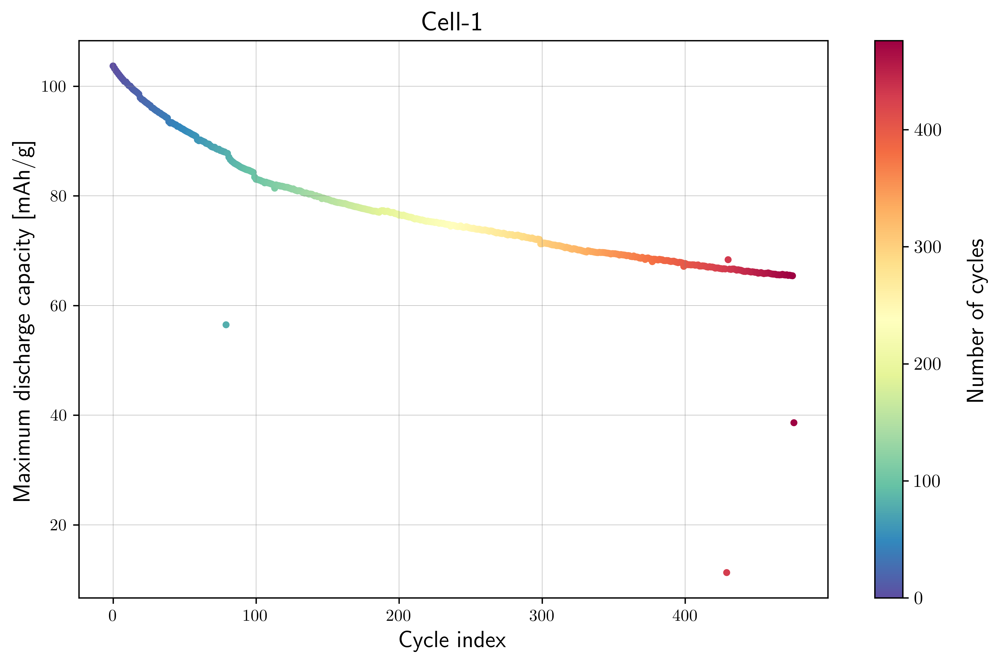
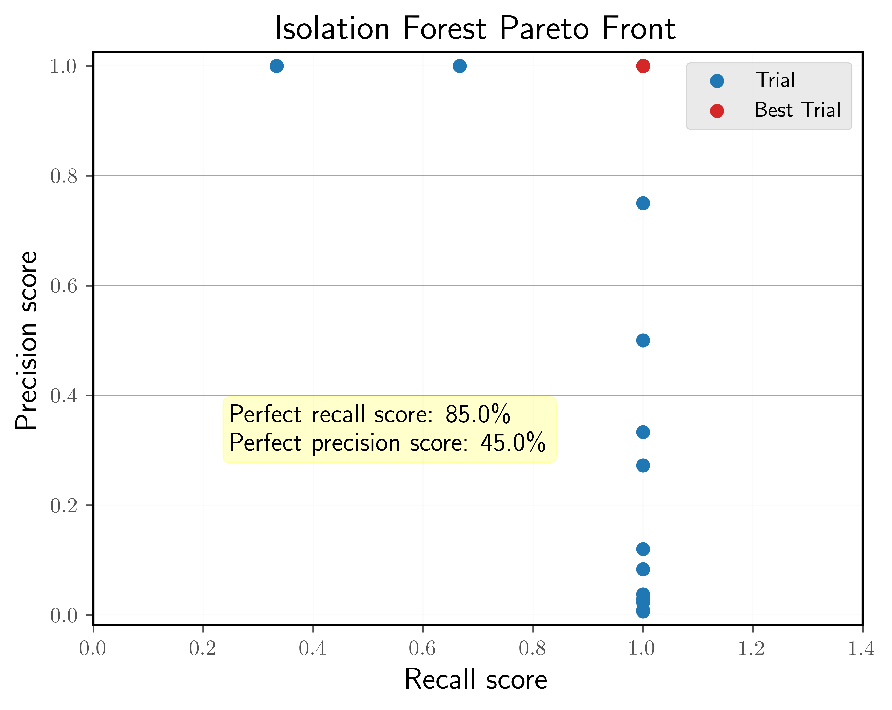

Detecting Capacity Fade Anomalies in Tohoku Solid-State Battery Dataset
###########################################################################

This example demonstrates how to detect capacity fade anomalies in the
Tohoku solid-state battery dataset using the Isolation Forest model.
The example covers:

Prerequisites
---------------

* Python 3.12 (recommended)
* Files on disk:

  * ``database/tohoku_benchmark_dataset.db`` (benchmark labels per cycle)

* (Optional) LaTeX installation if you want Matplotlib to render text with
  LaTeX:

  * A TeX distribution (e.g., TeX Live/MacTeX/MiKTeX), dvipng, and fonts
    like cm-super.
  * Don't have LaTeX installed? Either install it, or set
    ``rcParams["text.usetex"] = False``.

Before running the example in the ``quick_start_tutorials`` section, please
evaluate whether the global directory path specified in ``src/osbad/config.py``
needs to be updated:

.. code-block:: python

    # Modify this global directory path if needed
    PIPELINE_OUTPUT_DIR = Path.cwd().joinpath("artifacts_output_dir")

The following example of detecting capacity degradation anomalies in
solid-state lithium-ion batteries is also provided as a notebook in
``quick_start_tutorials/03_load_tohoku_dataset.ipynb``.

Step-1: Load libraries
---------------------------

Import the libraries into your local development environment, including the
``osbad`` library for benchmarking anomaly detection.

* ``Path`` is used for robust, cross-platform file paths.
* ``duckdb`` is the embedded analytical database engine storing the dataset.
* ``fireducks.pandas as pd`` gives you a pandas-compatible API;
  you can usually treat it like import pandas as pd.
* ``rcParams["text.usetex"] = True`` tells Matplotlib to render text via
  LaTeX. If you don't have LaTeX installed, flip this to False.
* ``EmpiricalCovariance`` from sklearn is used to calculate Mahalanobis
  distance for feature engineering.
* ``bconf``: project config utilities (e.g., where to write artifacts).
* ``BenchDB``: a thin layer around DuckDB that provides convenience loaders.
* ``ModelRunner``, ``hp``, ``modval``, ``bviz``: modeling, hyperparameters,
  model validation, and visualization helpers for benchmarking study in this
  project.

.. code-block:: python

  # Standard library
  from pathlib import Path
  import pprint

  # Third-party libraries
  import duckdb
  import fireducks.pandas as pd
  import matplotlib as mpl
  import matplotlib.pyplot as plt
  import numpy as np
  import optuna
  from matplotlib import rcParams
  from sklearn.covariance import EmpiricalCovariance

  rcParams["text.usetex"] = True

  # Custom osbad library for anomaly detection
  import osbad.config as bconf
  import osbad.hyperparam as hp
  import osbad.modval as modval
  import osbad.viz as bviz
  from osbad.database import BenchDB
  from osbad.model import ModelRunner

Step-2: Load Tohoku Benchmarking Dataset
------------------------------------------

* Connect to the Tohoku dataset stored in ``tohoku_benchmark_dataset.db``.
* The Tohoku dataset contains 10 cells. We use the ``cell_num_1``,
  ``cell_num_2``, ``cell_num_5`` and ``cell_num_6`` for training and
  ``cell_num_7``, ``cell_num_8``, ``cell_num_9`` and ``cell_num_10``
  for testing.
* Select a specific cell based on ``cell_index`` (e.g., ``cell_num_1``).
* Create an artifacts folder for that cell to save figures and outputs.
* Initialize ``BenchDB`` for the selected cell.
* Drop the outlier labels to simulate real-world anomaly detection where
  ground truth is unknown during prediction.

.. code-block:: python

    # Path to database directory
    DB_DIR = bconf.DB_DIR
    db_filepath = DB_DIR.joinpath("tohoku_benchmark_dataset.db")

    # Create a DuckDB connection
    con = duckdb.connect(
        db_filepath,
        read_only=True)

    # Load all training dataset from duckdb
    df_duckdb = con.execute(
        "SELECT * FROM df_tohoku_dataset").fetchdf()

    # Drop the additional index column
    df_duckdb = df_duckdb.drop(
        columns="__index_level_0__",
        errors="ignore")

    unique_cell_index_train = df_duckdb["cell_index"].unique()
    print(unique_cell_index_train)

    # Get the cell-ID from cell_inventory
    selected_cell_label = "cell_num_1"
    cell_num = selected_cell_label[-1]

    # Create a subfolder to store fig output
    # corresponding to each cell-index
    selected_cell_artifacts_dir = bconf.artifacts_output_dir(
        selected_cell_label)

    # Filter dataset for specific selected cell only
    df_selected_cell = df_duckdb[
        df_duckdb["cell_index"] == selected_cell_label]

    # Import the BenchDB class
    benchdb = BenchDB(
        db_filepath,
        selected_cell_label)

    # Drop the outlier labels
    df_selected_cell_without_labels = df_selected_cell.drop(
        "outlier", axis=1).reset_index(drop=True)

Step-3: Plot Capacity Fade Without Labels
-------------------------------------------

* Calculate the maximum discharge capacity per cycle to track capacity
  degradation over the battery's cycle life.
* Plot the capacity fade curve to visualize the battery's performance without
  showing anomaly labels.

.. code-block:: python

    # Calculate maximum capacity per cycle
    max_cap_per_cycle = (
        df_selected_cell_without_labels
            .groupby(["cycle_index"])["discharge_capacity"].max())
    max_cap_per_cycle.name = "max_discharge_capacity"

    unique_cycle_index = (
        df_selected_cell_without_labels["cycle_index"].unique())

    # Plot the cycling data without labels
    axplot = bviz.plot_cycle_data(
        xseries=unique_cycle_index,
        yseries=max_cap_per_cycle,
        cycle_index_series=unique_cycle_index)

    axplot.set_xlabel(
        r"Cycle index",
        fontsize=14)
    axplot.set_ylabel(
        r"Maximum discharge capacity [mAh/g]",
        fontsize=14)

    axplot.set_title(
        f"Cell-{cell_num}",
        fontsize=16)

    output_fig_filename = (
        "cycling_data_without_labels_"
        + selected_cell_label
        + ".png")

    fig_output_path = (
        selected_cell_artifacts_dir
        .joinpath(output_fig_filename))

    plt.savefig(
        fig_output_path,
        dpi=600,
        bbox_inches="tight")

    plt.show()

Step-4: Feature Engineering with Mahalanobis Distance
-------------------------------------------------------

* For the Tohoku dataset, we track sudden and unintended capacity drops over
  the cycle life.
* The features used are:

  * ``cycle_index``: Sequential cycle number
  * ``max_discharge_capacity``: Maximum discharge capacity per cycle
  * ``norm_mahal_dist``: Normalized Mahalanobis distance

* The Mahalanobis distance captures how far each cycle deviates from the
  typical distribution of both cycle index and capacity.
* Normalizing the Mahalanobis distance ensures values are between 0 and 1.

.. code-block:: python

    df_cycle_index = pd.Series(
        unique_cycle_index,
        name="cycle_index")

    # Input features for Mahalanobis distance
    df_features_per_cell = pd.concat(
        [df_cycle_index,
         max_cap_per_cycle],
        axis=1)

    Xfeat = df_features_per_cell.values

    # Calculate Mahalanobis distance based on cycle_index and
    # max_discharge_capacity
    cov = EmpiricalCovariance().fit(Xfeat)
    mahal_dist = cov.mahalanobis(Xfeat)

    df_maha_dist = pd.Series(
        mahal_dist,
        name="mahal_dist")

    # Merge calculated mahalanobis distance
    df_merge_features = pd.concat(
        [df_features_per_cell,
         df_maha_dist], axis=1)

    # Calculate maximum mahal_dist to normalize the distance calculation
    max_mahal_dist = (
        df_merge_features["mahal_dist"].max())

    df_merge_features["norm_mahal_dist"] = (
        df_merge_features["mahal_dist"]/max_mahal_dist)

    selected_feature_cols = (
        "max_discharge_capacity",
        "norm_mahal_dist")

Step-5: Hyperparameter Tuning with Optuna
-------------------------------------------

* Define the search space for Isolation Forest hyperparameters:

  * ``contamination``: Expected proportion of outliers (0.0 - 0.5)
  * ``n_estimators``: Number of trees in the forest (100 - 500)
  * ``max_samples``: Number of samples to train each tree
  * ``threshold``: Decision threshold for outlier probability (0.0 - 1.0)

* Use Optuna's TPE sampler to optimize for both precision and recall.
* Run 20 trials to find the best hyperparameter configuration.

.. code-block:: python

    total_cycle_count = len(df_selected_cell["cycle_index"].unique())

    hp_config_iforest = {
        "contamination": {"low": 0.0, "high": 0.5},
        "n_estimators": {"low": 100, "high": 500},
        "max_samples": {"low": 100, "high": total_cycle_count},
        "threshold": {"low": 0.0, "high": 1.0}
    }

    iforest_hp_config_filepath = (
        Path.cwd()
        .parents[0]
        .joinpath(
            "machine_learning",
            "hp_config_schema",
            "tohoku_hp_config",
            "iforest_hp_config.json"))

    bconf.create_json_hp_config(
        iforest_hp_config_filepath,
        hp_dict=hp_config_iforest)

    # Reload the hp module to refresh in-memory variables
    from importlib import reload
    reload(hp)

    # Instantiate an optuna study for iForest model
    sampler = optuna.samplers.TPESampler(seed=42)

    if_study = optuna.create_study(
        study_name="iforest_hyperparam",
        sampler=sampler,
        directions=["maximize","maximize"])

    if_study.optimize(
        lambda trial: hp.objective(
            trial,
            model_id="iforest",
            df_feature_dataset=df_merge_features,
            selected_feature_cols=selected_feature_cols,
            df_benchmark_dataset=df_selected_cell,
            selected_cell_label=selected_cell_label),
        n_trials=20)

Step-6: Aggregate Best Hyperparameters
----------------------------------------

* Extract the best trials from the Pareto front.
* Aggregate hyperparameters using median values to balance precision and
  recall.
* Export the optimized hyperparameters to CSV for reproducibility.

.. code-block:: python

    schema_iforest = {
        "threshold": "median",
        "contamination": "median",
        "n_estimators": "median_int",
        "max_samples": "median_int",
    }

    df_iforest_hyperparam = hp.aggregate_best_trials(
        if_study.best_trials,
        cell_label=selected_cell_label,
        model_id="iforest",
        schema=schema_iforest)

    # Evaluate percentage of perfect recall and precision score
    recall_score_pct, precision_score_pct = hp.evaluate_hp_perfect_score_pct(
        model_study=if_study)

    # Plot pareto front
    hp.plot_pareto_front(
        if_study,
        selected_cell_label,
        fig_title="Isolation Forest Pareto Front")

    plt.show()

    # Export current hyperparameters to CSV
    hyperparam_filepath =  Path.cwd().joinpath(
        "hp_01_iforest_hyperparam_tohoku.csv")

    hp.export_current_hyperparam(
        df_iforest_hyperparam,
        selected_cell_label,
        export_csv_filepath=hyperparam_filepath,
        if_exists="replace")

* This figure illustrates the Pareto fronts obtained from Bayesian optimization
  performed to maximize the precision and recall scores for Isolation Forest
  using the Tohoku dataset.
* The X-axis is the recall score (fraction of actual anomalies detected),
  whereas the Y-axis is theprecision score (fraction of predicted anomalies
  that are correct).
* While the blue scattered points represent all the trials evaluated during
  the optimization process, the red dots denote the best trials,
  which achieved the maximum recall and precision scores.
* The percentage of perfect recall or precision scores in the yellow-annotated
  box denotes the percentage of trials with the highest value in that metric
  among the Pareto front.

Step-7: Train Model with Best Hyperparameters
-----------------------------------------------

* Load the optimized hyperparameters from the CSV file.
* Create a ``ModelRunner`` instance with the selected features.
* Train the Isolation Forest model using the best hyperparameters.
* Predict outlier probabilities and identify anomalous cycles.

.. code-block:: python

    # Load best trial parameters from CSV output
    df_hyperparam_from_csv = pd.read_csv(hyperparam_filepath)

    df_param_per_cell = df_hyperparam_from_csv[
        df_hyperparam_from_csv["cell_index"] == selected_cell_label]

    param_dict = df_param_per_cell.iloc[0].to_dict()
    pprint.pp(param_dict)

    # Run the model with best trial parameters
    cfg = hp.MODEL_CONFIG["iforest"]

    runner = ModelRunner(
        cell_label=selected_cell_label,
        df_input_features=df_merge_features,
        selected_feature_cols=selected_feature_cols
    )

    Xdata = runner.create_model_x_input()

    model = cfg.model_param(param_dict)
    print(model)
    model.fit(Xdata)
    proba = model.predict_proba(Xdata)

    (pred_outlier_indices,
    pred_outlier_score) = runner.pred_outlier_indices_from_proba(
        proba=proba,
        threshold=param_dict["threshold"],
        outlier_col=cfg.proba_col
    )

    # Get df_outliers_pred
    df_outliers_pred = (df_merge_features[
        df_merge_features["cycle_index"]
        .isin(pred_outlier_indices)].copy())

    df_outliers_pred["outlier_prob"] = pred_outlier_score

Step-8: Predict Anomaly Score Map
-----------------------------------

* Generate a 2D contour map showing the anomaly probability across the
  feature space.
* Highlight the predicted anomalous cycles.
* The map helps visualize which regions of the feature space are considered
  anomalous by the model.

.. code-block:: python

    grid_offset_size = 1

    axplot = runner.predict_anomaly_score_map(
        selected_model=model,
        model_name="Isolation Forest",
        xoutliers=df_outliers_pred["max_discharge_capacity"],
        youtliers=df_outliers_pred["norm_mahal_dist"],
        pred_outliers_index=pred_outlier_indices,
        threshold=param_dict["threshold"],
        square_grid=False,
        grid_offset=grid_offset_size
    )

    axplot.set_xlabel(
        r"Maximum discharge capacity per cycle",
        fontsize=12)
    axplot.set_ylabel(
        r"Normalized Mahalanobis distance",
        fontsize=12)

    output_fig_filename = (
        f"iforest_grid_offset_size_{grid_offset_size}_"
        + selected_cell_label
        + ".png")

    fig_output_path = (
        selected_cell_artifacts_dir
        .joinpath(output_fig_filename))

    plt.savefig(
        fig_output_path,
        dpi=600,
        bbox_inches="tight")

    plt.show()

.. image:: docs_figure/iforest_grid_offset_size_1_cell_num_1.png
   :height: 420px
   :width: 600 px
   :alt: Anomaly score map from ``cell_num_1``
   :align: center

The anomaly score map visualizes the Isolation Forest model's decision
boundary in the two-dimensional feature space of maximum discharge capacity
and normalized Mahalanobis distance. Key observations from the map include:

**Color Gradient Interpretation:**

* Dark Blue Regions (outlier probability ≈ 0.0): Represent normal
  operating conditions where cycles exhibit typical capacity and distance
  values.
* Light Blue to White Regions (outlier probability ≈ 0.2-0.4): Transition
  zones where the model begins to detect deviations from normal behavior.
* Orange to Red Regions (outlier probability ≈ 0.6-0.8): Areas with
  moderate anomaly likelihood, indicating unusual combinations of capacity
  and distance.
* Dark Red Regions (outlier probability ≈ 1.0): High-confidence anomaly
  zones where cycles are strongly classified as outliers.

**Decision Boundary:**

* The dashed black line represents the decision threshold separating
  normal cycles from anomalous ones.

**Predicted Normal vs Anomalous Cycles:**

* Yellow stars mark the three detected anomalous cycles at indices 79, 429,
  and 476, annotated in the legend box.
* The majority of normal cycles cluster in the lower-right region, where
  the battery exhibits gradual degradation behavior.

This visualization demonstrates how the Isolation Forest model separates
anomalous capacity fade events from normal degradation patterns
using the engineered features of maximum discharge capacity and normalized
Mahalanobis distance.

Step-9: Model Performance Evaluation
--------------------------------------

* Compare predicted anomalies against ground truth labels.
* Generate a confusion matrix to visualize True Positives, False Positives,
  True Negatives, and False Negatives.
* Calculate performance metrics: precision, recall, F1-score, and accuracy.

.. code-block:: python

    df_eval_outlier = modval.evaluate_pred_outliers(
        df_benchmark=df_selected_cell,
        outlier_cycle_index=pred_outlier_indices)

    # Confusion matrix
    axplot = modval.generate_confusion_matrix(
        y_true=df_eval_outlier["true_outlier"],
        y_pred=df_eval_outlier["pred_outlier"])

    axplot.set_title(
        "Isolation Forest",
        fontsize=16)

    output_fig_filename = (
        "conf_matrix_iforest_"
        + selected_cell_label
        + ".png")

    fig_output_path = (
        selected_cell_artifacts_dir
        .joinpath(output_fig_filename))

    plt.savefig(
        fig_output_path,
        dpi=600,
        bbox_inches="tight")

    plt.show()

    # Evaluate model performance
    df_current_eval_metrics = modval.eval_model_performance(
        model_name="iforest",
        selected_cell_label=selected_cell_label,
        df_eval_outliers=df_eval_outlier)

    # Export model performance metrics to CSV output
    hyperparam_eval_filepath =  Path.cwd().joinpath(
        "eval_metrics_hp_single_cell_tohoku.csv")

    hp.export_current_model_metrics(
        model_name="iforest",
        selected_cell_label=selected_cell_label,
        df_current_eval_metrics=df_current_eval_metrics,
        export_csv_filepath=hyperparam_eval_filepath,
        if_exists="replace")

.. image:: docs_figure/conf_matrix_iforest_cell_num_1.png
   :height: 450px
   :width: 550 px
   :alt: Confusion matrix from ``cell_num_1``
   :align: center

Step-10: Visualize Predicted Anomalies
----------------------------------------

* Plot the capacity fade curve with predicted anomalies highlighted.
* Annotate the anomalous cycle indices on the plot.
* This visualization helps interpret where the model detected sudden capacity
  drops, which may indicate battery degradation events.

.. code-block:: python

    # Reset the sns settings
    mpl.rcParams.update(mpl.rcParamsDefault)
    rcParams["text.usetex"] = True

    pred_cap_outlier = max_cap_per_cycle[
        max_cap_per_cycle
            .index.isin(pred_outlier_indices)]

    axplot = bviz.plot_cycle_data(
        xseries=unique_cycle_index,
        yseries=max_cap_per_cycle,
        cycle_index_series=unique_cycle_index,
        xoutlier=pred_cap_outlier.index,
        youtlier=pred_cap_outlier)

    axplot.set_xlabel(
        r"Cycle index",
        fontsize=14)
    axplot.set_ylabel(
        r"Maximum discharge capacity [mAh/g]",
        fontsize=14)

    axplot.set_title(
        f"Cell-{cell_num}: Predicted Anomalies with Isolation Forest",
        fontsize=16)

    # Create textbox to annotate anomalous cycle
    textstr = '\n'.join((
        r"\textbf{Cycle index with anomalies:}",
        f"{list(pred_cap_outlier.index)}"))

    # properties for bbox
    props = dict(
        boxstyle='round',
        facecolor='wheat',
        alpha=0.5)

    # first 0.95 corresponds to the left right alignment starting
    # from left, second 0.95 corresponds to up down alignment
    # starting from bottom
    axplot.text(
        0.95, 0.95,
        textstr,
        transform=axplot.transAxes,
        fontsize=12,
        # ha means right alignment of the text
        ha="right", va='top',
        bbox=props)

    output_fig_filename = (
        "iforest_pred_cap_fade_with_outliers_"
        + selected_cell_label
        + ".png")

    fig_output_path = (
        selected_cell_artifacts_dir
        .joinpath(output_fig_filename))

    plt.savefig(
        fig_output_path,
        dpi=600,
        bbox_inches="tight")

    plt.show()

.. image:: docs_figure/iforest_pred_cap_fade_with_outliers_cell_num_1.png
   :height: 400px
   :width: 600 px
   :alt: Predicted anomalies with iForest from ``cell_num_1``
   :align: center

The figure shows the capacity fade curve with predicted anomalies highlighted.
These sudden capacity drops indicate potential degradation events in the
solid-state battery, which could be caused by:

* Electrolyte decomposition
* Interface resistance increase
* Mechanical damage to the solid electrolyte
* Lithium plating

The Isolation Forest model successfully identifies these point anomalies,
demonstrating its effectiveness for capacity fade detection in battery cycling
data.